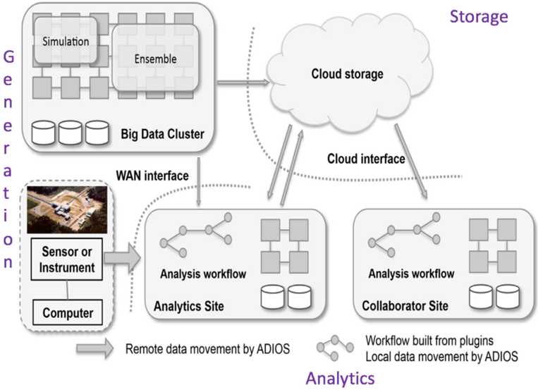
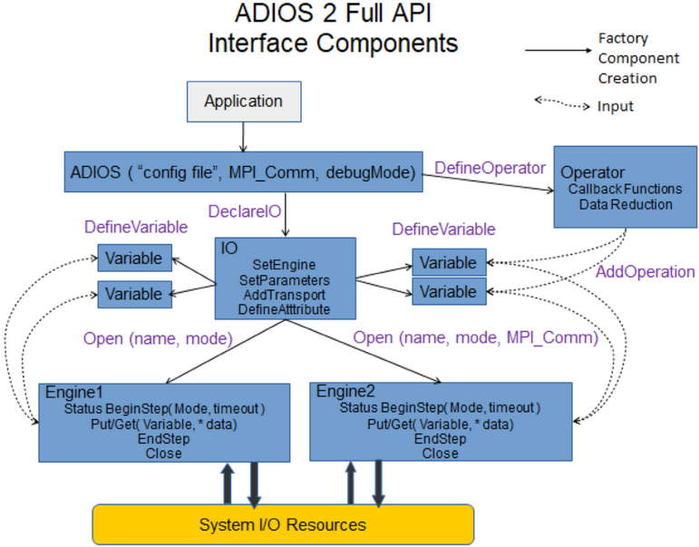
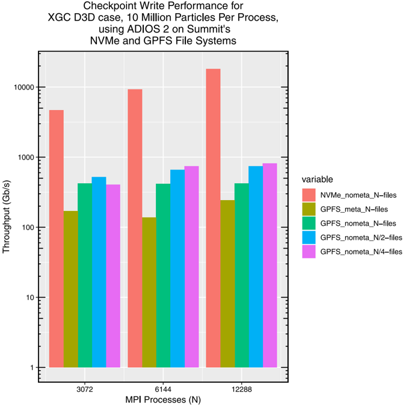
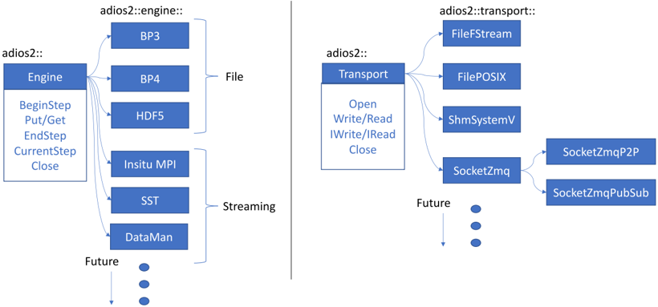
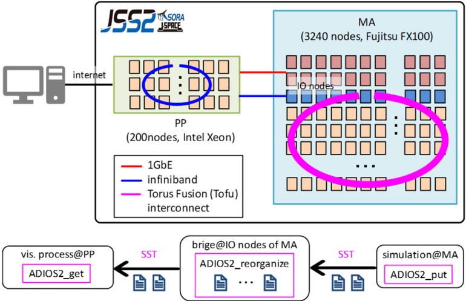

<!-- image -->

Original software publication

## ADIOS 2: The Adaptable Input Output System. A framework for high-performance data management

William F. Godoy ∗ , Norbert Podhorszki , Ruonan Wang a , Chuck Atkins , Greg Eisenhauer c , Junmin Gu d , Philip Davis e , Jong Choi a , Kai Germaschewski f , Kevin Huck g , Axel Huebl h , Mark Kim a , James Kress a , Tahsin Kurc i , Qing Liu j , Jeremy Logan a , Kshitij Mehta a , George Ostrouchov a , Manish Parashar e , Franz Poeschel h , David Pugmire a , Eric Suchyta a , Keichi Takahashi a , Nick Thompson a , Seiji Tsutsumi k , a a

a, a b

Lipeng Wan a , Matthew Wolf , Kesheng Wu d , Scott Klasky

a Oak Ridge National Laboratory, Oak Ridge, TN, USA

b Kitware Inc., Clifton Park, NY, USA

c School of Computer Science, Georgia Institute of Technology, Atlanta, GA, USA

d Lawrence Berkeley National Laboratory, Berkeley, CA, USA

e Computer Science Department, Rutgers University, New Brunswick, NJ, USA

f Space Science Center and Physics Department, University of New Hampshire, Durham, NH, USA

g University of Oregon, Eugene, OR, USA

h Helmholtz-Zentrum Dresden - Rossendorf, Dresden, Germany

## I. Department of Biomedical Informatics, Stony Brook University, Stony Brook, NY, USA

j Department of Electrical and Computer Engineering, New Jersey Institute of Technology, Newark, NJ, USA

k Japan Aerospace Exploration Agency, Sagamihara, Kanagawa, Japan

## a r t i c l e i n f o

Article history: Received 1 August 2019 Received in revised form 24 April 2020 Accepted 2 July 2020

Keywords: High-performance computing (HPC) Scalable I/O Luster GPFS file systems Staging RDMA Data science In-situ

Exascale computing

## Code metadata

Current code version

Permanent link to code/repository used for this code version

Legal Code License Code versioning system used Software code languages, tools, and services used Compilation requirements, operating environments If available Link to developer documentation/manual Support email for questions

## a b s t r a c t

We present ADIOS 2, the latest version of the Adaptable Input Output (I/O) System. ADIOS 2 addresses scientific data management needs ranging from scalable I/O in supercomputers, to data analysis in personal computer and cloud systems. Version 2 introduces a unified application programming interface (API) that enables seamless data movement through files, wide-area-networks, and direct memory access, as well as high-level APIs for data analysis. The internal architecture provides a set of reusable and extendable components for managing data presentation and transport mechanisms for new applications. ADIOS 2 bindings are available in C ++ 11, C, Fortran, Python, and Matlab and are currently used across different scientific communities. ADIOS 2 provides a communal framework to tackle data management challenges as we approach the exascale era of supercomputing.

© 2020TheAuthors. Published by Elsevier B.V. This is an open access article under the CC BY license (http://creativecommons.org/licenses/by/4.0/).

v2.6.0

https://github.com/ElsevierSoftwareX/SOFTX\_2019\_252

Apache License, 2.0 (Apache-2.0)

git

C ++ , C, Fortran, Python, Matlab, MPI, CMake

CMake, C ++ 11 compiler, Linux, OS X, Microsoft Windows 64-bit

https://adios2.readthedocs.io

godoywf@ornl.gov, pnorbert@ornl.gov, klasky@ornl.gov

∗ Corresponding author. E-mail address: godoywf@ornl.gov (W.F. Godoy).

## Contents lists available at ScienceDirect

## SoftwareX

journal homepage: www.elsevier.com/locate/softx

<!-- image -->

<!-- image -->

## 1. Motivation and significance

As supercomputers approach the exascale era [[1]](#ref-1), several hardware architectures have emerged [2,3] to counteract the cadence slowdown of Moore's law [4,5]. Due to the ability to run larger and more complex simulations, data input output (I/O) operations are anticipated to become a larger bottleneck than in current petascale systems [6,7]. To circumvent I/O bottlenecks, vendors and leadership facilities are proposing new high-bandwidth/low-latency memory, communication, and storage architectures [1,8]. Implementations include direct-memory access through Infiniband [[9]](#ref-9), Omni-Path [[10]](#ref-10), and NVLink [[11]](#ref-11), as well as intermediate storage using non-volatile random-access memory (NVRAM) [[12]](#ref-12). As a result, there is a strong need to study each new paradigm in order to achieve optimal I/O performance without having to pay the cost of rewriting codebases for each platform [[7]](#ref-7).

Large-scale scientific data management is challenging during the data generation, transfer, storage, and processing stages. As illustrated in Fig. 1, data lifecycles require efficient data movement across different transport media: files, wide-area-networks (WAN) and memory staging areas. Several software tools exist to handle each aspect of the data lifecycle. For example, the HDF5 [[13]](#ref-13) and NetCDF [[14]](#ref-14) libraries have been widely used for storage and organization of large datasets. Their parallel implementations, Parallel HDF5 [[13]](#ref-13) and PNetCDF [[15]](#ref-15), expose their functionality to parallel computing environments based on the standard message passing interface, MPI [[16]](#ref-16). At a lower level, the MPI-2 standard introduces the MPI I/O API for raw bytes file manipulation in parallel applications, a popular implementation is ROMIO [[17]](#ref-17). On the other hand, interprocess/intraprocess network transport mechanisms are provided by well-established implementations: the MPI standard [[16]](#ref-16), ZeroMQ [[18]](#ref-18), OpenSHMEM [[19]](#ref-19). Hence, there are a plethora of interface options and communication models for each particular mechanism of data transport.

The present work introduces ADIOS 2: the Adaptable Input Output System version 2, a framework designed to serve the scientific community in their data management needs at several scales: from laptops, desktops, cloud services to large data producers in supercomputing applications. ADIOS 2 expands the performance legacy of the earlier versions of ADIOS that provide scalable parallel I/O as documented in previous works [20-23]. ADIOS 2 provides a unified application programming interface (API) with a level of abstraction focusing on how data is produced and consumed in scientific applications to reduce the cost of integrating different data transport technologies. Applications using ADIOS 2 do not need to dramatically modify their source code to evaluate performance trade-offs when moving their data through different transport media.

A flexible and portable framework is required due to the dynamic architectural changes shaping the path to exascale computing [2,3]. As such, the internal architecture of ADIOS 2 focuses on component reusability and extensibility for seamless integration of novel data management algorithms. ADIOS 2 is written in C ++ 11 [[24]](#ref-24) to take advantage of the portable functionality added to the language, e.g. threads and algorithms, thus reducing reliance on platform-specific implementations. ADIOS 2 development adopts modern software engineering practices such as unit testing, continuous integration, and documentation to make the final product accessible to the scientific community.

ADIOS 2 is part of the United States Department of Energy (DOE) Exascale Computing Project (ECP) software technology stack for data and visualization [1,2].

## 2. Software description

When designing the ADIOS 2 software infrastructure three levels of interaction APIs were identified:

## 1. Public Low-Level API: large-scale HPC simulations codes, workflows, and ecosystem components
## 2. Public High-Level API: analysis and visualization using data science high-level languages frameworks
## 3. Private APIs: ADIOS 2 library internal components.

The design philosophy targets specific aspects to better serve interactions with each API level. The rationale is listed as follows,

## Public Low-level API:

- Unified API: to reduce the learning curve for different data transport strategies
- MPI [[16]](#ref-16) based library (optional non-MPI): reducing costs of handling low-level I/O related network tasks
- Self-describing ''Variables'' and ''Attributes'': to reduce the costs of manipulating low-level byte formats
- ''Engine'' abstraction: to allow multiple I/O solutions (file, stream, WAN) with minimal changes to the application code
- ''Deferred Put/Get'' abstraction: data transfer is done by default in deferred mode (lazy evaluation) to minimize lowlevel system operations as we group ''Variables'' in a step, while sync mode (immediate execution) is treated as the special case
- ''BeginStep/EndStep'' abstraction: to match the more natural production and consumption cycle of scientific data. Users do not need to track ''step'' information
- ''Operation'' abstraction: incorporate novel in-house or external algorithms for data manipulation pre or post movement: e.g. reduction techniques, user callbacks
- Key/value optimizations: provide fine-tuning options to evaluate I/O performance trade-offs for different application scenarios

## Public High-Level API:

- Flat learning curve: resemble native I/O for easy integration with high-level languages and their data analysis ecosystem, mainly C ++ , Python, Matlab
- Runtime input settings: provide an interface for parameter settings without requiring compilation
- Ecosystem: analysis tools built around the library ( e.g. bpls , format converters, data visualization models).

## Private APIs,

- Development Toolkit: provide a set of reusable and tested components in a modular architecture
- Modern Software Practices: automated continuous integration (CI) for quality testing, coding standards, issue tracking system for community engagement.

## 2.1. Software architecture

## 2.1.1. Public API architecture

ADIOS 2 public interfaces are implemented using the Pointer to Implementation (PImpl) idiom [[25]](#ref-25). ADIOS 2 provides a stable public API, as of version 2.5.0, at two levels:

- Low-Level API: designed for HPC applications, provides greater level of control and granularity. Available in C ++ 11, Fortran, C, and Python.
- High-Level API: designed for simple data analysis tasks, resembles nativate language I/O APIs for a flat learning curve. Available in C ++ 11, Python, and Matlab.

## Scientific Campaign Data Lifecycle



Fig. 1. Scientific data lifecycle data management overview illustrating generation, processing, transfer, storage and analysis tasks. ADIOS 2 provides an abstract and unified framework reusing the same API for different transport modes.

<!-- image -->



A schematic representation is provided in Fig. 2 for the lowlevel API components and their relationship from an application's point of view. ADIOS 2 uses a ''factory pattern'' [[26]](#ref-26) in which the ADIOS component is at the top-level in the factory hierarchy. ADIOS is the only component ''owned'' by the application, all other components refer to an element inside a container in its corresponding ADIOS factory. Applications can create as many ADIOS factory components as required. Table 1 provides a summary description for the role of each component in I/O workflow composition using ADIOS 2.

ADIOS 2 also provides high-level APIs in C ++ 11, Python and Matlab, that resemble their native language implementations for file manipulation for easy integration with data analysis ecosystems available in those languages. Users will find these APIs suitable for simple tasks in which performance is not critical, e.g. quick data analysis and testing.

Examples for the public low-level and high-level APIs can be found in Section 3, Listings 1 and 2, respectively.

## 2.1.2. Private API architecture

The main goal of the ADIOS 2 internal architecture is to provide a set of extensible, reusable, and tested toolkit components for developers. The private internal architecture of ADIOS 2 adopts the Open Systems Interconnection (OSI) [[33]](#ref-33) standard. This layered abstraction model delineates the scope and functionality of each class component in the overall hierarchy of the object-oriented architecture. As shown in Fig. 3, each toolkit component can be mapped to the OSI software layers, 7 through

4.



At the heart of ADIOS 2 lies the concept of the abstract ''Engine''. Engines execute the I/O heavy tasks and are conceived as workflows tackling specific application areas as illustrated in Table 2. Fig. 4 illustrates the extendable object-oriented nature of

Table 1 Low-Level API components functionality description.

| Component           | Description                                                                                                                                                           |
|---------------------|-----------------------------------------------------------------------------------------------------------------------------------------------------------------------|
| ADIOS               | Sets MPI communicator domain Process configuration runtime settings Factory of IO and Operator components Only object whose memory is owned by the application        |
| IO                  | I/O tasks configuration: how, what, where Sets Engine Parameters and Transports Factory owner of Variables, Attributes and Engines                                    |
| Variable            | User data and metadata representation                                                                                                                                 |
| Attribute           | Additional ''human-readable'' information for a Variable or a dataset                                                                                                 |
| Engine (abstract)   | Executes heavy tasks: buffering, transport management Manages system resources Current: BPFile (default), HDF5, InSitu-MPI, SST, DataMan (WAN), SST                   |
| Operator (abstract) | Applies Variable data operations inside an Engine Data Reduction, lossy: zfp [[27]](#ref-27), SZ [[28]](#ref-28), MGARD [[29]](#ref-29); lossless: PNG [[30]](#ref-30), bzip2 [[31]](#ref-31), Blosc [[32]](#ref-32) Callback Functions |

the Engine, layers 7 through 4, and the Transport, layer 4, classes. They provide unified interfaces for multiple raw bytes movement backends tackling different media in the lower hardware layers of the OSI model.



Design choices favoring reusability allows Engine designers to have a set of available components to study their performance trade-offs when prototyping or extending an Engine. As an example, the BP serializer and deserializer components, OSI layer 6 in Fig. 3 (BP3 and BP4), are used in two staging engines: InSituMPI and SST, and by default in the BPFile engine, for their

Fig. 2. Full Low-Level API components factory hierarchy in ADIOS 2.

<!-- image -->

Fig. 3. Mapping of the ADIOS 2 internal software architecture layers to the standard OSI model [[33]](#ref-33) abstraction.

| OSILayer   | OSILayer                  | ADIOS2classes                                                                                                            | ADIOS2classes                                                           | ADIOS2classes                        | ADIOS2classes                 |
|------------|---------------------------|--------------------------------------------------------------------------------------------------------------------------|-------------------------------------------------------------------------|--------------------------------------|-------------------------------|
|            | 7Application              | ADIOS,IO,Variable,Attribute,Operator                                                                                     | ADIOS,IO,Variable,Attribute,Operator                                    | ADIOS,IO,Variable,Attribute,Operator | Engine                        |
| 6          | Presentation              | Format:nativebinary-pack:BP3,BP4;jsonbased:DataMan Profiling:lochrono,Timer Compressionlossy:ZFP,SZ,MGARD;lossless:BZIP2 | Simplified Staging Transport: FFS (layer6), SST(layer5), EVPath(layer4) | Interoperability HDF5                | Engine                        |
| 5          | Session                   | TransportManagers:BPManager,DataMan(WAN),InSituMPI MPI_Aggregator:MPI_Chain                                              | Simplified Staging Transport: FFS (layer6), SST(layer5), EVPath(layer4) | Interoperability HDF5                | Engine                        |
|            | 4Transport                | File:POsIX1/O,stdio,fstream Network:MPI,RDMA（future) WAN:ZMQ                                                             | Simplified Staging Transport: FFS (layer6), SST(layer5), EVPath(layer4) | Interoperability HDF5                | Engine                        |
| 3 2 1      | Network DataLink Physical | HARDWARELAYERS(outsideADIOS2)                                                                                            | HARDWARELAYERS(outsideADIOS2)                                           | HARDWARELAYERS(outsideADIOS2)        | HARDWARELAYERS(outsideADIOS2) |

metadata indexing, buffer aggregation across MPI processes, and data compression capabilities.

## 2.2. Software functionalities

ADIOS 2 has two primary focus areas in terms of data I/O transports:

## 1. Parallel file I/O
## 2. Parallel intra/interprocess data staging

The functionalities of ADIOS 2 can be mapped directly to a category of use-cases that each engine addresses. Table 2 summarizes these functionalities for currently available engines.

In addition, each engine provides a set of parameters to finetune performance for each application I/O pattern. For example, the current default engine (BPFile) allows for setting performance parameters: number of steps to buffer, number of generated subfiles, and frequency of collective metadata indexing.

Table 2 ADIOS 2 Engines and areas of application.

| Application   | Engine                    | Application Areas                                                                                                                     |
|---------------|---------------------------|---------------------------------------------------------------------------------------------------------------------------------------|
| File          | BPFile HDF5               | Checkpoint/restart, analysis data, zero-copy buffer, file-based streaming, code coupling HDF5 compliant files                         |
| Data staging  | SST SSC InSituMPI DataMan | Interprocess communication Interprocess communication On-node interprocess communication Peer-to-peer TCP/IP Wide-Area-Networks (WAN) |

## 3. Illustrative examples

The following examples illustrate usage of the low-level and high-level APIs.

<!-- image -->

Fig. 4. ADIOS 2 Engine and Transport internal toolkit abstract classes showing their hierarchy and extendable virtual interfaces to dispatch to multiple media: file, sockets, shared-memory, etc.

Listing 1 illustrates how ADIOS 2 C ++ 11 low-level API is integrated with a generic HPC simulation. The example presents a sequence of interactions of the ADIOS, IO, Variable, and Engine components. A fundamental aspect is that an ADIOS 2 interface requires minimal changes when setting the engine type and parameters, so users can evaluate different transport modes either at compile or run time.

```
// ADIOS 2 starting point // config.xml: string config file name for adios2 runtime parameters // comm: IO communicator adios2::ADIOS adios(" config.xml " ,comm); // Setting the IO process // " analysis " is the unique string describing the overall IO task adios2::IO io = adios.DeclareIO("analysis"); // Add human-readable info to your data io.DefineAttribute<std::string>("app", " Euler Solver " ); // Regular MPI partition in " x " slowest dimension const adios2::Dims shape = {size * Nx, Ny}; const adios2::Dims start = {rank * Nx, Ny}; const adios2::Dims count = { Nx, Ny}; // Self-describing Variable metadata: name, type, dimensions adios2::Variable<double> varT = io.DefineVariable<double>("T", shape, start, count}; adios2::Variable<double> varUx = io.DefineVariable<double>("Ux", shape, start, count}; adios2::Variable<double> varUy = io.DefineVariable<double>("Uy", shape, start, count}; // Optionally, add extra info to a variable io.DefineAttribute<std::string>("units", " K " ,"T"); // Set the Engine type and parameters // This is typically the one section users need to modify in the API // to evaluate different transport modes. // SetEngine and SetParameter can also be set at runtime // using a config file in the ADIOS constructor
```

Listing 1: C ++ 11 Low-Level API Write Example

```
// Each available engine enable different data transport modes: // file: BPFile (default), BP3, BP4, HDF5 // memory-to-memory: InSituMPI, DataMan, SST, SSC io.SetEngine("BPFile"); // set parameter in key/value string form // e.g. produce substream/subfiles half the number of MPI processes io.SetParameter(" SubStreams ", std::to_string(size/2) ); // create an Engine using an unique string // to start heavy-lifting write I/O tasks adios2::Engine engine = io.Open("euler.bp", adios2::Mode::Write); while( iterate ) { // generic computation, e.g. matrix solver // T, Ux, Uy are std::vector<double> compute(T,Ux,Uy); // start an I/O step engine.BeginStep(); // Put are deferred/lazy evaluation calls by default // T, Ux, Uy, memory addresses can't be modified until EndStep engine.Put(varT, T.data() ); engine.Put(varUx, Ux.data() ); engine.Put(varUy, Uy.data() ); // EndStep executes the data transfer engine.EndStep(); // T, Ux, Uy memory can be now be modified ... } out.Close();
```

Listing 2 illustrates how to read ADIOS 2 data using the Python high-level API. ADIOS 2 provides a ''pythonic'' interface of an iterable container of steps using a generic ''read'' function. As such, variable data is always returned as a numpy [[34]](#ref-34) array for

a straight-forward integration with popular data science frameworks using numpy as a core component, e.g. Pandas [[35]](#ref-35) and SciPy [[36]](#ref-36).

```
import adios2 with adios2.open("euler.bp", " r " ) as fh: for fstep in fh: # retrieve current step step = fstep.current_step() # inspect variables dictionary in current step step_vars = fstep.available_variables() for name, info in step_vars.items(): print(" variable_name: " + name) for key, value in info.items(): print("\t" + key + " : " + value) print("\n") if( step == 0 ): size_in = fh_step.read("size") # read variables in current step # returning a numpy array for easy integration # with data science frameworks (e.g. pandas, scipy) # either read the entire variable T = fstep.read("T") # or optionally read a window selection Ux = fstep.read("Ux", start, count) Uy = fstep.read("Uy", start, count)
```

Listing 2: Python High-Level API Read Example

## 4. Impact

The following is a summary of the current efforts in integrating ADIOS 2 in several scientific computing frameworks and the impact on their data management needs.

## 4.1. Plasma physics



- -XGC : The X-point included Gyrokinetic Code (XGC) is a fusion simulation code to model gyrokinetic plasma physics [39,40]. ADIOS has been integrated to handle their largescale I/O operations on DOE's supercomputers, including Summit [[8]](#ref-8), as well as to support multi-physics coupling workflows [41,42]. Performance gains for using ADIOS's aggregation, staging, and NVRAM/burst buffers support have been reported in various research works [41-44]. This is illustrated in Fig. 5 for the write performance throughput of XGC checkpoint-restart on Summit's GPFS and NVMe I/O systems.
- -GTC : The Gyrokinetic Toroidal Code (GTC) [[45]](#ref-45) simulates billions of plasma particles inside a fusion reactor. The output of GTC consists of small, frequent diagnostics data (low volume, high velocity data), large-sized field data (high frequency, moderate volume data), and checkpoint-restart files (low frequency, high volume data). GTC uses ADIOS 2 to: (1) optimize data file outputs, (2) analyze diagnostics data using its Python high-level interface, and (3) as an input to visualize field and particle data [[46]](#ref-46).
- -PIConGPU : the relativistic, fully-accelerated, electromagnetic particle-in-cell code with primary applications in plasma physics and laser-particle acceleration. PIConGPU [47,48] is written in performance-portable C ++ based on the Alpaka library [49,50] and benefits from ADIOS's aggregation and data compression methods. ADIOS 2 SST staging method has recently been added via the openPMD project [[51]](#ref-51), providing a high-level abstraction for meshed fields and particle data. Targeted use-cases are rapid prototyping for loosely coupled in-situ reductions with petabytes of data per simulation via on and off-node buffering (e.g. over NVRAM/burst buffers) on the Summit supercomputer [[8]](#ref-8).

## 4.2. Earth science

- -E3SM : ADIOS 2 is integrated into the Parallel IO framework (PIO) as a backend for I/O in Energy Exascale 3D System Model [[52]](#ref-52). Currently, ADIOS reduces I/O bottlenecks by a factor of 50x by delaying data reorganization outside extreme scale supercomputers like Titan. Efforts are currently ongoing to port this functionality to the Summit supercomputer [[8]](#ref-8).
- -SPECFEM3D : ADIOS 2 is being integrated in the spectralelement global seismic wave propagation, SPECFEM3D\_ GLOBE, framework's forward simulation and adjoint process [[53]](#ref-53). Running 1,480 earth quakes simulations produces 1.5 petabytes of wave field data on 15,360 nodes of the Titan supercomputer in about 7 hours. The adjoint simulation later reads in all of the generated data. ADIOS 2 allows for efficient data transfers and self-describing mechanisms at these scales.

## 4.3. Radio astronomy

- -Casacore SKA : The Square Kilometer Array (SKA) is being designed to be the largest data producer radio telescope in the world. ADIOS 2 is currently being deeply integrated into the fundamental radio astronomy data the Casacore Table Data System [[54]](#ref-54). Early exploratory work suggested improved performance for their I/O workflows such as data staging, and near-real-time data compression [23,55,56].

## 4.4. Aerospace engineering

- -UPACS-LES : ADIOS 2 has been integrated into UPACS-LES [[38]](#ref-38), an in-house program for Computational Fluid Dynamics (CFD) in the Japan Aerospace Exploration Agency (JAXA) for the simulation of the aeroacoustics in aircrafts and launch vehicles. ADIOS 2 flexibility is essential to their post-processing tasks on the JAXA's Supercomputer System Generation 2 (JSS2) system [[37]](#ref-37). Fig. 6 shows a schematic representation of the heterogeneous nature of JSS2 and the post-processing pipeline workflow, using the SST staging engine in ADIOS 2, that bypasses the file system.

## 4.5. Community frameworks engagements

Efforts are currently ongoing to integrate ADIOS 2 in the following community frameworks to impact their data management and scalable I/O needs:

- LAMMPS: Molecular Dynamics Simulator [[57]](#ref-57)
- MFEM: Modular Finite Element Methods Library [[58]](#ref-58)
- OpenFoam: The open source CFD toolbox [[59]](#ref-59)
- VTK and VTK-m: The Visualization Toolkit [60,61]
- The Trilinos Project [[62]](#ref-62)
- PETSc: Portable, Extensible Toolkit for Scientific Computation [[63]](#ref-63).

Fig. 5. XGC Checkpoint writing using ADIOS 2 on Summit supercomputer. ADIOS 2 BPFile engines allow for scalable parallel file I/O using optimization parameters to: (i) skipping collective metadata at write, nometa, (regenerated at post-run), (ii) selecting a custom number of files fewer than the number of MPI processes.

<!-- image -->

Fig. 6. Overview of the JSS2 system at JAXA [[37]](#ref-37) and layout for in transit visualization workflows using staging capabilities in ADIOS 2 in the UPACS-LES CFD framework [[38]](#ref-38).

<!-- image -->

## 5. Conclusions

ADIOS 2 serves the scientific community in their data transport, transform and storage needs. By providing a unified API, ADIOS 2 allows the scientific community to focus on publishing and subscribing their data where and when required without having to handle a plethora or low-level I/O interfaces. ADIOS 2 aims to provide scalable parallel I/O functionality geared towards the next generation of exascale supercomputers, in addition to highlevel mechanisms for data analysis. ADIOS 2 has been adopted by several high-performance scientific computing frameworks. This paper introduces the ADIOS 2 open-source framework to a broader audience seeking to explore new paradigms in their data management needs.

## Declaration of competing interest

The authors declare that they have no known competing financial interests or personal relationships that could have appeared to influence the work reported in this paper.

## Acknowledgments

This research was supported by the Exascale Computing Project (17-SC-20-SC), a collaborative effort of the U.S. Department of Energy Office of Science and the National Nuclear Security Administration. This research used resources of the Oak Ridge Leadership Computing Facility at the Oak Ridge National Laboratory, which is supported by the Office of Science of the U.S. Department of Energy under Contract No. DE-AC05-00OR22725.

## References

- [1] Kothe D, Lee S, Qualters I. Exascale computing in the United States. Comput Sci Eng 2018. http://dx.doi.org/10.1109/MCSE.2018.2875366, 1-1.

- [2] US Department of Energy. The exascale computing project. URL https: //www.exascaleproject.org/.

- [3] Vazhkudai SS, de Supinski BR, Bland AS, Geist A, Sexton J, Kahle J, et al. The design, deployment, and evaluation of the CORAL pre-exascale systems. In: Proceedings of the international conference for high performance computing, networking, storage, and analysis. Piscataway, NJ, USA: IEEE Press; 2018, p. 52:1-12.

- [4] Moore GE. Cramming more components onto integrated circuits. Electronics 1965;38(8):114-7. http://dx.doi.org/10.1109/jproc.1998.658762.

- [5] Eeckhout L. Is Moore's Law slowing down? What's next? IEEE Micro 2017;37(4):4-5. http://dx.doi.org/10.1109/MM.2017.3211123.

- [6] Lang S, Carns P, Latham R, Ross R, Harms K, Allcock W. I/O performance challenges at leadership scale. In: Proceedings of the conference on high performance computing networking, storage and analysis. 2009, p. 1-12. http://dx.doi.org/10.1145/1654059.1654100.

- [7] Klasky S, Wolf M, Ainsworth M, Atkins C, Choi J, Eisenhauer G, et al. A view from ORNL: Scientific data research opportunities in the big data age. In: 2018 IEEE 38th international conference on distributed computing systems. 2018, p. 1357-68. http://dx.doi.org/10.1109/ICDCS.2018.00136.

- [8] Oak Ridge Leadership Computing Facility. Summit supercomputer. URL https://www.olcf.ornl.gov/summit/.

- [9] Liu J, Wu J, Panda DK. High performance RDMA-based MPI implementation over InfiniBand. Int J Parallel Program 2004;32(3):167-98. http://dx.doi. org/10.1023/B:IJPP.0000029272.69895.c1.

- [10] Birrittella MS, Debbage M, Huggahalli R, Kunz J, Lovett T, Rimmer T, et al. Enabling scalable high-performance systems with the Intel omni-path architecture. IEEE Micro 2016;36(4):38-47. http://dx.doi.org/10.1109/MM. 2016.58.

- [11] Foley D, Danskin J. Ultra-performance pascal GPU and NVLink interconnect. IEEE Micro 2017;37(2):7-17. http://dx.doi.org/10.1109/MM.2017.37.

- [12] Liu N, Cope J, Carns P, Carothers C, Ross R, Grider G, et al. On the role of burst buffers in leadership-class storage systems. In: 012 IEEE 28th symposium on mass storage systems and technologies. 2012, p. 1-11. http://dx.doi.org/10.1109/MSST.2012.6232369.

- [13] The HDF Group. Hierarchical Data Format, version 5. 1997, http://www. hdfgroup.org/HDF5/.

- [14] Rew R, Davis G. NetCDF: an interface for scientific data access. IEEE Comput Graph Appl 1990;10(4):76-82. http://dx.doi.org/10.1109/38.56302.

- [15] Li J, Liao W-k, Choudhary A, Ross R, Thakur R, Gropp W, et al. Parallel netCDF: A high-performance scientific I/O interface. In: Proceedings of the 2003 ACM/IEEE conference on supercomputing. New York, NY, USA: ACM; 2003, p. 39. http://dx.doi.org/10.1145/1048935.1050189.

- [16] Forum MP. MPI: A message-passing interface standard. Tech. rep., Knoxville, TN, USA: University of Tennessee; 1994.

- [17] Thakur R, Lusk E, Gropp W. Users guide for ROMIO: A high-performance, portable MPI-IO implementation. 1997, http://dx.doi.org/10.2172/564273.

- [18] Akgul F. ZeroMQ. Packt Publishing; 2013.

- [19] Chapman B, Curtis T, Pophale S, Poole S, Kuehn J, Koelbel C, et al. Introducing OpenSHMEM: SHMEM for the PGAS community. In: Proceedings of the fourth conference on partitioned global address space programming model. New York, NY, USA: ACM; 2010, p. 2:1-3. http://dx.doi.org/10.1145/ 2020373.2020375.

- [20] Liu Q, Logan J, Tian Y, Abbasi H, Podhorszki N, Choi JY, et al. Hello ADIOS: the challenges and lessons of developing leadership class I/O frameworks. Concurr Comput: Pract Exper 2014;26(7):1453-73. http://dx.doi.org/10. 1002/cpe.3125.

- [21] Lofstead JF, Klasky S, Schwan K, Podhorszki N, Jin C. Flexible IO and integration for scientific codes through the adaptable IO system (ADIOS). In: Proceedings of the 6th international workshop on challenges of large applications in distributed environments. New York, NY, USA: ACM; 2008, p. 15-24. http://dx.doi.org/10.1145/1383529.1383533.

- [22] Chen JH, Choudhary A, de Supinski B, DeVries M, Hawkes ER, Klasky S, et al. Terascale direct numerical simulations of turbulent combustion using S3D. Comput Sci Discov 2009;2(1). 015001.

- [23] Wang R, Harris C, Wicenec A. AdiosStMan: Parallelizing casacore table data system using adaptive IO system. Astron Comput 2016;16:146-54. http://dx.doi.org/10.1016/j.ascom.2016.05.003.

- [24] Stroustrup B. The C++ programming language. 4th ed. Addison-Wesley Professional; 2013.

- [25] Sutter H. Exceptional C++: 47 engineering puzzles, programming problems, and solutions. Boston, MA, USA: Addison-Wesley Longman Publishing Co., Inc.; 2000.

- [26] Gamma E, Helm R, Johnson R, Vlissides J. Design patterns: Elements of reusable object-oriented software. Boston, MA, USA: Addison-Wesley Longman Publishing Co., Inc.; 1995.

- [27] Lindstrom P. Fixed-rate compressed floating-point arrays. IEEE Trans Vis Comput Graphics 2014;20(12):2674-83. http://dx.doi.org/10.1109/TVCG. 2014.2346458.

- [28] Di S, Cappello F. Fast error-bounded lossy HPC Data Compression with SZ. In: 2016 IEEE international parallel and distributed processing symposium. 2016, p. 730-9. http://dx.doi.org/10.1109/IPDPS.2016.11.

- [29] Ainsworth M, Tugluk O, Whitney B, Klasky S. Multilevel techniques for compression and reduction of scientific data-The multivariate case. SIAM J Sci Comput 2019;41(2):A1278-303. http://dx.doi.org/10.1137/ 18M1166651.

- [30] Schalnat G, Dilger A, Randers-Pehrson G, et al. Portable network graphics (PNG) reference library. 1996, URL http://www.libpng.org/.

- [31] Seward J. bzip2. 1996, URL http://www.bzip.org/.

- [32] Alted F. Blosc, an extremely fast, multi-threaded, meta-compressorlibrary - Blosc main page. 2010, URL http://www.blosc.org.

- [33] Zimmermann H. OSI reference model - The ISO model of architecture for open systems interconnection. IEEE Trans Commun 1980;28(4):425-32. http://dx.doi.org/10.1109/TCOM.1980.1094702.

- [34] Oliphant T. NumPy: A guide to NumPy. USA: Trelgol Publishing; 2006, URL http://www.numpy.org/.

- [35] McKinney W. Data structures for statistical computing in Python. In: van der Walt S, Millman J, (editors). Proceedings of the 9th Python in science conference. 2010, p. 51-6.

- [36] Virtanen P, Gommers R, Oliphant TE, Haberland M, Reddy T, Cournapeau D, et al. SciPy 1.0-fundamental algorithms for scientific computing in Python. 2019, arXiv e-prints arXiv:1907.10121.

- [37] Japan Aerospace Exploration Agency. JSS2: JAXA supercomputer system generation. URL https://www.jss.jaxa.jp/en/.

- [38] Yamazaki H, Enomoto S, Yamamoto K. A common CFD platform UPACS. In: High performance computing: Third international symposium. 2000, p. 182-90. http://dx.doi.org/10.1007/3-540-39999-2.

- [39] Chang C-S, Ku S. Spontaneous rotation sources in a quiescent tokamak edge plasma. Phys Plasmas 2008;15(6). 062510.

- [40] Ku S, Chang C-S, Diamond P. Full-f gyrokinetic particle simulation of centrally heated global ITG turbulence from magnetic axis to edge pedestal top in a realistic tokamak geometry. Nucl Fusion 2009;49(11). 115021.

- [41] Dominski J, Ku S, Chang C-S, Choi J, Suchyta E, Parker S, et al. A tightcoupling scheme sharing minimum information across a spatial interface between gyrokinetic turbulence codes. Phys Plasmas 2018;25(7). 072308.

- [42] Choi JY, Chang C-S, Dominski J, Klasky S, Merlo G, Suchyta E, et al. Coupling exascale multiphysics applications: Methods and lessons learned. In: 2018 IEEE 14th international conference on e-Science. IEEE; 2018, p. 442-52.

- [43] Podhorszki N, Klasky S, Liu Q, Docan C, Parashar M, Abbasi H, et al. Plasma fusion code coupling using scalable I/O services and scientific workflows. In: Proceedings of the 4th workshop on workflows in support of large-scale science. ACM; 2009, p. 8.

- [44] D'Azevedo E, Abbott S, Koskela T, Worley P, Ku S-H, Ethier S, et al. The fusion code XGC: Enabling kinetic study of multiscale edge turbulent transport in ITER. In: Exascale scientific applications. Chapman and Hall/CRC; 2017, p. 529-52.

- [45] Lin Z, Hahm TS, Lee W, Tang WM, White RB. Turbulent transport reduction by zonal flows: Massively parallel simulations. Science 1998;281(5384):1835-7.

- [46] Wan L, Mehta KV, Klasky SA, Wolf MD, Wang HY, Wang WH, et al. Data management challenges of exascale scientific simulations: A case study with the Gyrokinetic Toroidal Code and ADIOS. 2019.

- [47] Bussmann M, Burau H, Cowan TE, Debus A, Huebl A, Juckeland G, et al. Radiative signatures of the relativistic Kelvin-Helmholtz instability. In: Proceedings of the international conference on high performance computing, networking, storage and analysis. New York, NY, USA: ACM; 2013, p. 5:1-12. http://dx.doi.org/10.1145/2503210.2504564.

- [48] Huebl A. PIConGPU: Predictive simulations of laser-particle accelerators with manycore hardware [Ph.D. thesis], Technische Universität Dresden; 2019, http://dx.doi.org/10.5281/zenodo.3266820.

- [49] Zenker E, Worpitz B, Widera R, Huebl A, Juckeland G, Knüpfer A, et al. Alpaka - an abstraction library for parallel kernel acceleration. 2016, CoRR abs/1602.08477. arXiv:1602.08477, URL http://arxiv.org/abs/1602.08477.

- [50] Matthes A, Widera R, Zenker E, Worpitz B, Huebl A, Bussmann M. Tuning and optimization for a variety of many-core architectures without changing a single line of implementation code using the Alpaka library. 2017, arXiv:1706.10086, URL https://arxiv.org/abs/1706.10086.

- [51] Koller F, Poeschel F, Huebl A. C++ &amp; Python API for scientific I/O with openPMD. 2019, http://dx.doi.org/10.14278/rodare.27.

- [52] E3SM Project. Energy exascale earth system model (E3SM). 2018, Computer software. http://dx.doi.org/10.11578/E3SM/dc.20180418.36.

- [53] Komatitsch D, Tromp J. Spectral-element simulations of global seismic wave propagation-I. Validation. Geophys J Int 2002;149(2):390-412. http: //dx.doi.org/10.1046/j.1365-246X.2002.01653.x.

- [54] van Diepen G. Casacore table data system and its use in the MeasurementSet. Astron Comput 2015;12:174-80. http://dx.doi.org/10.1016/j. ascom.2015.06.002.

- [55] Wang R, Harris C. Scaling radio astronomy signal correlation on heterogeneous supercomputers using various data distribution methodologies. Exp Astron 2013;36(3):433-49. http://dx.doi.org/10.1007/s10686-013-9340-7.

- [56] Wang R, Wicenec A, Harris C. Performance analysis of filesystem I/O using HDF5 and ADIOS on a Cray XC20. In: Cray user group. 2014.

- [57] Plimpton S. Fast parallel algorithms for short-range molecular dynamics. J Comput Phys 1995;117(1):1-19. http://dx.doi.org/10.1006/jcph.1995.1039.

- [58] MFEM: Modular finite element methods library. mfem.org. http://dx.doi. org/10.11578/dc.20171025.1248.

- [59] Weller HG, Tabor G, Jasak H, Fureby C. A tensorial approach to computational continuum mechanics using object-oriented techniques. Comput Phys 1998;12(6):620-31. http://dx.doi.org/10.1063/1.168744.

- [60] Schroeder W, Martin K, Lorensen B. The visualization toolkit-an object-oriented approach to 3D graphics. 4th ed. Kitware, Inc.; 2006.

- [61] Moreland K, Sewell C, Usher W, Lo L, Meredith J, Pugmire D, et al. VTK-M: Accelerating the visualization toolkit for massively threaded architectures. IEEE Comput Graph Appl 2016;36(3):48-58. http://dx.doi.org/ 10.1109/MCG.2016.48.

- [62] Heroux MA, Bartlett RA, Howle VE, Hoekstra RJ, Hu JJ, Kolda TG, et al. An overview of the Trilinos project. ACM Trans Math Software 2005;31(3):397-423. http://dx.doi.org/10.1145/1089014.1089021.

- [63] Balay S, Abhyankar S, Adams MF, Brown J, Brune P, Buschelman K, et al. PETSc users manual. Tech. rep. ANL-95/11 - revision 3.11, Argonne National Laboratory; 2019, URL https://www.mcs.anl.gov/petsc.