## Tuning HDF5 subfiling performance on parallel file systems

Suren Byna ∗ , Mohamad Chaarawi † , Quincey Koziol ∗ , John Mainzer ‡ , and Frank Willmore ‡

∗

Lawrence Berkeley National Laboratory, USA. Email: SByna@lbl.gov, koziol@lbl.gov † Intel Corporation, USA. Email: mchaarawi@gmail.com ‡ The HDF Group. Email: mainzer@hdfgroup.org, frank.willmore@hdfgroup.org

## Abstract

Subfiling is a technique used on parallel file systems to reduce locking and contention issues when multiple compute nodes interact with the same storage target node. Subfiling provides a compromise between the single shared file approach that instigates the lock contention problems on parallel file systems and having one file per process, which results in generating a massive and unmanageable number of files. In this paper, we evaluate and tune the performance of recently implemented subfiling feature in HDF5. In specific, we explain the implementation strategy of subfiling feature in HDF5, provide examples of using the feature, and evaluate and tune parallel I/O performance of this feature with parallel file systems of the Cray XC40 system at NERSC (Cori) that include a burst buffer storage and a Lustre disk-based storage. We also evaluate I/O performance on the Cray XC30 system, Edison, at NERSC. Our results show performance benefits of 1.2X to 6X performance advantage with subfiling compared to writing a single shared HDF5 file. We present our exploration of configurations, such as the number of subfiles and the number of Lustre storage targets to storing files, as optimization parameters to obtain superior I/O performance. Based on this exploration, we discuss recommendations for achieving good I/O performance as well as limitations with using the subfiling feature.

## I. INTRODUCTION

Subfiling is a technique used on parallel file systems to reduce locking and contention issues when multiple compute nodes interact with the same I/O node or storage target. Subfiling provides a compromise between the single shared file approach that instigates the lock contention problems on parallel file systems and having one file per process, which results in generating a massive and unmanageable number of files. Collecting compute ranks that are topologically close to each other into a group and having each group access a single file will increase bandwidth to the file system, since most contention problems can be avoided. Parallel file format libraries such as PnetCDF [[7]](#ref-7) and ADIOS [[10]](#ref-10) have implemented subfiling feature. Application libraries, such as BoxLib [[2]](#ref-2), have implemented subfiling for storing data in multiple files in custom binary format. Parallel log structured file system (PLFS) remaps application data into a layout of multiple files that gives better performance on a given file system [[4]](#ref-4). All these implementations proved that writing multiple files instead of single shared file improves parallel I/O performance.

In this paper, we have evaluated and tuned the performance of recently implemented subfiling feature in the Hierarchical

Data Format version 5 (HDF5) [[13]](#ref-13). HDF5 is a widely used parallel I/O library at leadership supercomputing facilities and tuning parallel I/O performance of subfiling benefits a large number of applications using HDF5. In specific, we have explained the implementation strategy of subfiling feature in HDF5, provided examples of using the feature, and evaluated and tune parallel I/O performance of this feature. We have evaluated this feature on parallel file systems of a Cray XC30 system (Edison) and a Cray XC40 system (Cori) installed at The National Energy Research Scientific Computing Center (NERSC). Edison has a disk-based Lustre file system and Cori contains an SSD-based burst buffer storage managed by Cray DataWarp and a disk-based storage managed by Lustre parallel file system. We have used parallel I/O kernels from a plasma physics simulation for writing data and a clustering algorithm for reading the data produced by the plasma simulation to evaluate performance. Our results show an advantage in the range of 1.2X to 6.5X with writing subfiles in comparison to writing a single shared HDF5 file. We have also observed that the achieved I/O rate with subfiling is 70% of the peak bandwidth on the Lustre file system (/scratch3) of Edison even when we were using small fraction of the entire compute system. We have also varied the number of subfiles to be created and the number of object storage targets to be used on Lustre file system to obtain optimal performance. The advantage of subfiling on Cori's disk-based Lustre and SSDbased burst buffers increases at larger scales. At a scale of 16K MPI processes, we observed ≈ 200 GB/s write rate on Cori's Lustre file system (/cscratch) and ≈ 410 GB/s write rate on the burst buffer. In this paper, we will present our recommendations for choosing the number of subfiles and for deciding how the data should be laid out on the storage nodes.

Overall, the contributions of this paper are:

- Description of an implementation of subfiling in HDF5 along with a background to HDF5's Virtual Datasets (VDS) feature.
- Performance evaluation of subfiling feature in HDF5 on the parallel file systems of Cori, a Cray XC40 system installed at the National Energy Research Scientific Computing Center (NERSC): We have presented I/O performance of write and read functionality of two real world use cases from plasma physics field.
- Evaluation of tuning parameters, such as the number of subfiles and the number of storage targets to obtain optimal performance using SSD-based Cray DataWarp burst buffer system and on disk-based Lustre parallel file system.

The reminder of the paper is organized as follows. We provide a brief background to HDF5 and related work on subfiling in section II. We discuss our current implementation of subfiling in HDF5 in section III. In section V, we present the scalability results of using HDF5 subfiling on Edison and Cori file systems, and then evaluate obtaining optimal performance by tuning the number of subfiles and number of storage targets. We conclude our discussion with a brief discussion of recommendations of using subfiling feature in HDF5 and current limitations in Section VI.

## II. BACKGROUND TO SUBFILING

HDF5 is a data model, binary file format, and I/O library that maps an application's data into the HDF5 data model and stores it as HDF5 file(s). Basic elements of the HDF5 data model are multidimensional arrays of structures (HDF5 dataset). Associated datasets can be grouped together using the HDF5 grouping structure (HDF5 group). Data stored in HDF5 datasets can be read or written using regular POSIX I/O or MPI I/O, allowing multiple processes to access the same HDF5 dataset in an HDF5 file or multiple datasets in the same HDF5 file. An application running on an HPC system can also choose to have selected processes write to separate HDF5 files and rely on other software to assemble the files or use HDF5 features like external links or file mounting to assemble data for post-processing, e.g., for visualization.

The separate files I/O model is very attractive for large scale applications, which require fast data dumps for checkpoints, where the management of large number files per time step is not an issue. Several parallel I/O libraries have implemented writing separate subfiles [[7]](#ref-7), [[10]](#ref-10), [[4]](#ref-4).


The advantage of writing a file per process or using n processes to write m files is well known and widely use by HPC applications. It was recently demonstrated in a project between The HDF Group and researchers at Diamond Light Source (DLS), the United Kingdom's national synchrotron science facility. Parallel write performance was investigated on the DLS cluster by appending 2D image frames, where sections of the image are distributed across the processes, to an extensible 3D dataset [[12]](#ref-12). For both the IBM General Parallel File System (GPFS) and the Lustre file system, the performance of executing serial writes per process was anywhere from five to ten times faster than writing to a single file, for this particular application, Fig. 1. An obvious disadvantage of this approach is non-self-describing mapping between application data and data stored in the underlying HDF5 files.

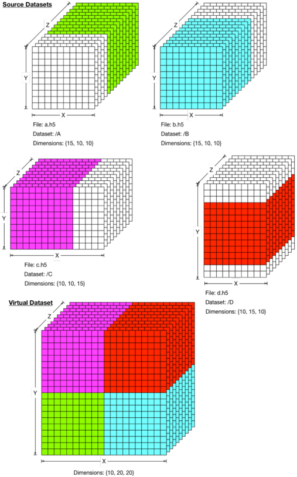

HDF5 library version 1.10.0 introduced the notion of a Virtual Dataset (VDS), which allows for pieces of a dataset to be stored in separate HDF5 files (called source files) and datasets (called source datasets), but would be viewed as a single HDF5 dataset from a master file, Fig. 2.

<!-- image -->

Number of Processes

Fig. 1. Parallel write performance on a cluster at Diamond Light Source (DLS) facility for appending 2D image frames to a 3D dataset. The performance of executing serial writes per process ranges from five to ten times faster than writing to a single file [[12]](#ref-12).

Fig. 2. Colored regions of a Virtual Dataset are stored in the corresponding colored regions of the source datasets.

<!-- image -->

A VDS is composed logically of blocks of data stored in the source datasets. Source datasets may be in the same file as the VDS or in another file. Source datasets may themselves be virtual datasets.

Regardless of how a virtual dataset is composed, it appears transparently to the user as a dataset, and can be accessed via the HDF5 dataset API, just like any other dataset. The current implementation allows only sequential access to the VDS data. A VDS can be repacked using the h5repack commandline utility into an HDF5 dataset with more conventional contiguous or chunked storage.

Because a virtual dataset allows for data to be stored in multiple source files, it emerged as a natural mechanism for the implementation of subfiling in HDF5.

Using API calls implemented for this research, it is possible to leverage an additional mechanism of parallelization to the task of writing, for example, a checkpoint file, allowing data to be split logically along application-specific and user-defined boundaries, in a way that a parallel file system alone does not implicitly support. The current implementation requires the user to explicitly split the MPI\_COMM\_WORLD communicator into multiple subcommunicators, and creates one subfile per subcommunicator at file creation time. At dataset creation time, the user must state explicitly what portion of the dataset each process will write. Each processes in a given subcommunicator then writes its portion of the dataset to the subfile associated with the communicator.

An application can then read data stored in the VDS using sequential or parallel access. No special knowledge is required of how data is stored in the subfiles since the initial mapping is stored with the VDS itself. The next section describes in greater detail the HDF5 subfiling programming model and outlines its implementation.

## III. IMPLEMENTATION OF SUBFILING

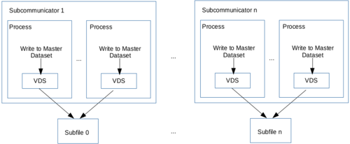

Subfiling is a compromise between performing file-perprocess I/O and doing MPI I/O on a single file shared by all processes in communicator. By grouping parallel tasks, a smaller number of files is generated that file-per-process, providing the performance benefit, while also maintaining a workable number of open files on the system. Fig. 3 shows groups of processes writing to a shared dataset using subfiling.

This section outlines HDF5 subfiling programming model and summarizes changes to the HDF5 library. The changes targeted feasibility of the feature in HDF5 and demonstration of its performance enhancement potential.

## A. HDF5 Subfiling Programming Model

New functions were introduced to set and get subfiling configuration settings.

1) Creating an HDF5 file with subfiling enabled: Before subfiling can be enabled, the communicator must be split n -ways, where n is the number of subfiles to be written, e.g., assuming round-robin assignment of tasks to nodes, the

Fig. 3. Processes in subcommunicators writing regions of the dataset. Each reqion is stores in the subfile associated with the subcommunicator. In HDF5 subfiling is implemented by using Virtual Dataset (VDS).

<!-- image -->

following C code will split the communicator in such a way that all tasks on a given node will write to the same subfile:

```
int color = mpi_rank % subfile; if (n_nodes > subfile) color = (mpi_rank % n_nodes) % subfile; MPI_Comm_split (..., &subfile_comm);
```

Names of subfiles are defined for each sub-communicator as shown:

```
sprintf(subfile_name,"Subfile_%d.h5",color)
```

To create an HDF5 file with subfiling enabled for some or all datasets, a file access property must be set using the H5Pset\_subfiling\_access to indicate the number of process groups that will write to corresponding subfiles, subfile name, MPI communicator and MPI info object for the subfile that the calling process will access. After the file access property is set up, the HDF5 file can be created as usual.

2) Creating an HDF5 dataset with subfiling enabled: When an HDF5 file is created with subfiling enabled, datasets can be individually created as subfiled or not.

In order to create a subfiled dataset the HDF5 library needs to know what region of the dataset is to be stored in which subfile. Therefore, it is required to indicate, at dataset creation time, what region(s) each group of processes is responsible for writing to the dataset. A new function H5Pset\_subfiling\_selection is called on the dataset access property list to indicate the regions of the dataset that the process will write to or read from later. In the current implementation, regions cannot intersect. After the dataset access property is set with the H5Pset\_subfiling\_selection function, one can proceed to create the dataset as usual.

The dataset created in the master HDF5 file will be a VDS, and each group of processes will create a subfile to hold a source dataset that maps to a portion of the VDS. The source dataset will contains regions of data written by the processes of the same color.

## 3) Writing: :

Once an HDF5 file and a dataset are created to use subfiling, I/O is performed with H5Dwrite/H5Dread as usual.

The coding segment below demonstrates the set up for subfiling when the number of process groups is mpi\_size , which is the total number of processes in the communicator. The number of subfiles created will be mpi\_size .

```
/* Create file access property list. Set MPI access and enable subfiling. */ fapl_id = H5Pcreate(H5P_FILE_ACCESS); H5Pset_fapl_mpio(fapl_id, comm, info); /* Set the name of the subfile and use it when enabling subfiling. */ sprintf(subfile_name, "Subfile_%d.h5", mpi_rank); H5Pset_subfiling_access(fapl_id, subfile_name, MPI_COMM_SELF, MPI_INFO_NULL); /* Create the file with the subfiling feature. The call creates the master file and the subfiles. */ fid = H5Fcreate(filename, ..., fapl_id); /* Define hyperslab parameters */ .... /* Set the dataspace selection that the calling process will write to. */ ret = H5Sselect_hyperslab(sid, H5S_SELECT_SET, start, stride, count, block); /* Create the dataset with subfiling enabled. */ dapl_id = H5Pcreate(H5P_DATASET_ACCESS); H5Pset_subfiling_selection(dapl_id, sid); did = H5Dcreate(fid, DATASET, ..., sid, ..., dapl_id); /* Write to the dataset. */ H5Dwrite(did, H5T_NATIVE_INT, mem_sid, sid, H5P_DEFAULT, wbuf);
```

- 4) Reading: Since a subfiled dataset is a virtual dataset, it does not require special calls to be read. However, an API call to H5Pset\_subfiling\_access may take advantage of the knowledge of how the data was subfiled, in order to speed retrieval. It requires that the same subfiling info be used (coloring/task-grouping) for the file access property list passed to the H5Fopen call.

## B. HDF5 Library Modifications

To summarize, the following modifications were done to the HDF5 library to enable subfiling.

- 1) File creation: Modification of the file creation code to create subfiles when requested.
- 2) Dataset creation: Modification of the dataset creation code to create the needed datasets in the subfiles, and to configure the master dataset so that the existing VDS code would manage the I/O to the source datasets in the subfiles.
- 3) API extension: Modifications required to support the API extensions discussed above.

## C. Other considerations

Modifications required to bypass code disabling VDS storage in parallel, and to bypass other sanity checks triggered by our initial modications to the HDF5 library.

## IV. EXPERIMENTAL SETUP

## A. Platforms

We have performed our experiments to evaluate the HDF5 subfiling feature on 'Edison', a Cray XC30 system, and on 'Cori', a Cray XC40 system, both located at NERSC. Edison's compute partition consists of 5586 compute nodes. Within each compute node are two 2.4 GHz 12-core Intel Ivy-Bridge processors and 64 GB of 1866MHz DDR3 DRAM. The compute nodes are connected using Cray Aries interconnect in Dragonfly topology with 23.7 TB/s global bandwidth. On Cori, there are two types of compute partitions, one with 2,388 nodes that have Intel Xeon E5-2698 v3 (Haswell) CPUs with 32 cores per node running at 2.3GHz and another with 9,688 nodes that have Intel Xeon Phi (Knights Landing) processors with 68 cores per node. In this study, we have used the partition with Haswell CPUs, where each node has 128 GB DDR4 2133 MHz memory.

We have used one file system (known as ' scratch3 ') on Edison and two file systems (' cscratch ' and burst buffer) on Cori. The 'scratch3' file system on Edison has a total of 3.2 PB of storage provided by a Cray Sonexion 1600 Lustre appliance. Scratch3 has 36 object store servers (OSSs) and 36 object store targets (OSTs) with 72 GB/s I/O bandwidth. For all of our experiments, files are striped across all 144 OSTs. Cori has one scratch file system, named /global/cscratch1 , which has 30 PB disk capacity and 700 GB/sec IO bandwidth. We refer to this file system as ' cscratch ' in this paper. The 'cscratch' file system is shared between Cori and Edison system, whereas the file system can be accessed from both systems. It is configured with 248 Lustre OSSs and 248 OSTs. Cori also has a SSD-based burst buffer 1 managed by Cray DataWarp [[8]](#ref-8). The burst buffer has a storage capacity of 1.8 PB and a peak I/O performance specification of 1.7 TB/s.

In our experiments on Edison 'scratch3', we have used all the 36 OSTs for striping the files. On 'cscratch', we have used 128 OSTs for tests running on 1024 (1K), 2048 (2K), and 4096

## 1. Cori burst buffer architecture: http://www.nersc.gov/users/computationalsystems/cori/burst-buffer/burst-buffer/

(4K) MPI processes and used 192 OSTs for those running on 8192 (8K) and 16384 (16K) MPI processes.

## B. I/O Kernels

We have used two parallel I/O kernels in this evaluation: VPIC-IO and BD-CATS-IO. These kernels have been derived from two applications, Vector Particle-In-Cell (VPIC) [[5]](#ref-5), [[3]](#ref-3) and Big Data Clustering at Trillion Particle Scale (BD-CATS) [[11]](#ref-11), [[1]](#ref-1). The VPIC-IO is a write intensive benchmark and BD-CATS-IO is a read intensive one.

1) VPIC-IO: VPIC is a highly optimized and scalable particle physics simulation developed by Los Alamos National Lab [[5]](#ref-5). VPIC-IO [[3]](#ref-3) uses H5Part [[9]](#ref-9) to create a file, write eight 1D array variables and close the file. The H5Part API provides a simple veneer for issuing HDF5 calls corresponding to a time-varying, multi-variate particle data model. We extracted all the H5Part function calls of the VPIC code to form the VPIC-IO kernel. The particle data written in the kernel is random data of float data type. The I/O motif of VPIC-IO is a 1D particle array of a given number of particles and each particle has eight variables. The I/O kernel writes 8 million particles per MPI process and the total size of the file increases as the number of MPI processes increases.

2) BD-CATS-IO: Clustering is an important data mining kernel used in many scientific applications, such as finding halos in cosmology, satellite image segmentation, noise filtering and outlier detection. BD-CATS is an end-to-end system for performing clustering analysis on large scale scientific data [[11]](#ref-11). BD-CATS internally uses DBSCAN, a density based clustering algorithm [[6]](#ref-6). The BD-CATS processing begins by reading an input file containing the data to be clustered. BDCATS-IO kernel [[1]](#ref-1) is the reader of input files that store properties of particles in arrays using HDF5 file format, where each property is stored as a HDF5 Dataset. Using P MPI processes for running the BD-CATS-IO kernel for reading the data related to N particles, each HDF5 dataset is logically split into P equal partitions. Each process p reads a subset of particles starting from p ∗ N/P to ( p + 1) ∗ N/P . The last MPI process in addition reads data related to the remainder of N/P .

## C. Measurements

1) I/O time measurements: The VPIC-IO kernel initiates data structures of corresponding simulation with random data and write data to file system. In the BD-CATS-IO kernel, we have read the HDF5 files written by the VPIC-IO kernel. Both kernels use MPI-IO in collective I/O mode, where the H5Part uses Lustre optimizations. The collective I/O mode is also known as the two-phase I/O mode, where a small set of aggregators among the MPI processes of a job interact with the file system to perform reads or writes. The H5Part/H5Block in the Lustre optimization mode sets the number of MPI-IO aggregators equal to a multiple of the number of Lustre OSTs. We have measured 'I/O time' by using gettimeofday() calls before opening a file and after closing the file. This interval includes the time to open a HDF5 file in write mode, to write metadata of HDF5 datasets, to write the data to the underlying file system, and to close the file. We select the maximum I/O time of all the MPI processes assuming all the processes wait until an I/O phase is finished. The 'IO rate' reported in the results section ( § V) is the ratio of the total amount of data read or written to the I/O time.

## V. RESULTS

In this section, we present an evaluation of the subfiling feature in HDF5. We have used three types of evaluation: scalability of writing and reading subfiles, tuning subfiling factor, i.e., the number of processes writing to a subfile, and tuning Lustre stripe settings. In all three cases, we have measured the I/O time and calculated the I/O rate.

- Using the VPIC-IO benchmark, we have tested the scalability of writing subfilies and compared I/O performance with writing data to a single file. Both the subfiles and the single file were written in the HDF5 format. We have used BD-CATS-IO benchmark for reading the files written by the VPIC-IO benchmark. (See § V-A)
- For tuning the subfiling factor, we ran the VPIC-IO benchmark with 4K MPI processes and varied the number of subfiles from 1 file to 4096 files. In these tests, we have kept the striping parameter of Lustre constant. On Edison 'scratch3', we have used 36 OSTs and on 'cscratch', we have used 128 OSTs - equal to the number of compute nodes. On both file systems, we have set the stripe size to be 32MB. (See § V-B1)
- For tuning the Lustre stripe settings, we have varied the Lustre stripe count from 1 to 248 on 'cscratch' with 32MB stripe size, accessing from Edison and from Cori. We have also compared the performance with ' default ' Lustre stripe setting of 1 OST as stripe count and 1MB as stripe size. (See § V-B2)

We have run each job at least three times and selected the best performing instance to report the results in this section. As performance I/O subsystems that are shared by all jobs running on the system depends on interference due to communication and I/O activity of other jobs, we consider selection of the best performing instance represents the capability of the subfiling feature as well as the performance of the file systems used in this study.

## A. Scalability of subfiling

1) Subfile write performance on Edison and Cori.: We have evaluated performance of subfiling with VPIC-IO benchmark writing data to 'scartch3' from Edison, to 'cscratch' from both Edison and Cori, and to burst buffer from Cori. For all these cases, we have compared performance of writing HDF5 subfiles with that of writing a single shared HDF5 file. On Edison, we have run VPIC-IO using 1K, 2K, and 4K MPI processes 2 and on Cori, we have run the benchmark from 1K to 16K, incrementing with multiples of two.

$$^{2} K = 1024$$

In Figure 4, we compare the I/O time of VPIC-IO writing a single file and multiple subfiles to 'scratch3' on Edison. We observe up to 4X performance improvement with writing subfiles. In these tests, we have kept the number of processes writing a subfile, called subfiling factor, as 32. The observed I/O rate (see Figure 5) is 67% of the peak I/O rate of the file system (i.e., 75 GB/s) at 2K cores writing 512 GB data.

In Figure 6, we compare the IO rate of writing data to 'cscratch' file system from Edison. Compared with writing a single file, subfiling feature achieves an average of 4X performance improvement. With 4K process case, the performance improvement is 6.5X. As shown in Figure 7, for the same file system, writing subfiles from Cori's Haswell nodes achieve 10% to 20% performance improvement compared to that of writing a single shared file up to 8K cores. At 16K-process scale, we observe 60% improvement with the subfiling feature. The contrast between performance improvement of subfiling performed on Edison and on Cori may be due to the network links to the 'cscratch' file system.

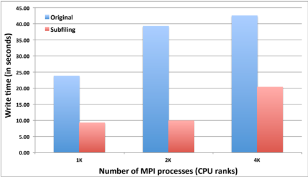

Fig. 4. Observed I/O time with VPIC-IO writing a single shared file (Original) and writing subfiles (Subfiling) at different scales on the Edison scratch3 Lustre file system.

<!-- image -->

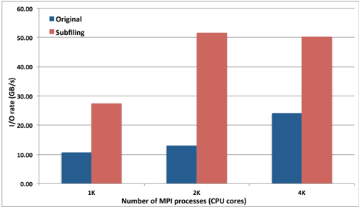

Fig. 5. Observed I/O rate with VPIC-IO writing a single shared file (Original) and writing subfiles (Subfiling) at different scales on the Edison scratch3 Lustre file system.

<!-- image -->

In Figure 8, we compare subfiling and single file writing performance with VPIC-IO to the burst buffer on Cori, varying the number of Haswell processes from 1K to 16K. Similar to

<!-- image -->

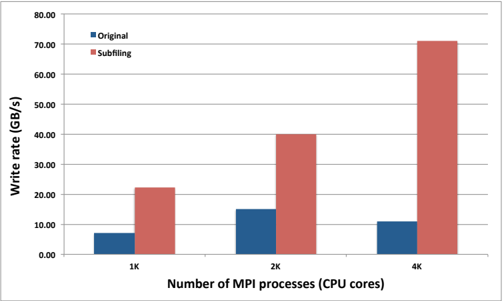

Fig. 6. Observed I/O rate with VPIC-IO writing a single shared file (Original) and writing subfiles (Subfiling) at different scales to the Global cscratch file system from Edison.

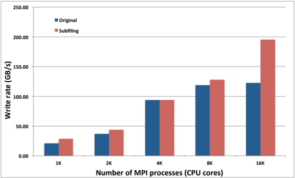

Fig. 7. Observed I/O rate with VPIC-IO writing a single shared file (Original) and writing subfiles (Subfile) at different scales to the Global cscratch file system from Cori's Haswell partition.

<!-- image -->

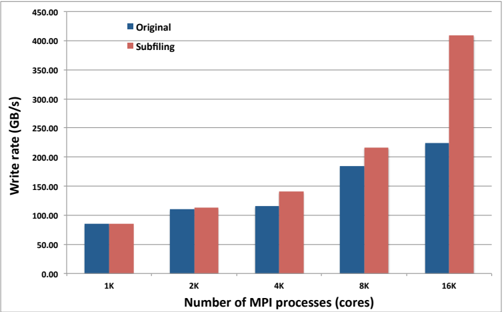

Fig. 8. Observed I/O rate with VPIC-IO writing a single shared file (Original) and writing subfiles (Subfiling) at different scales to the burst buffer on Cori's Haswell partition.

<!-- image -->

writing 'cscratch' from Cori Haswell, subfiling performance up to 8K processes is 10% to 20%. With 16K processes, the performance of subfiling improves by 80%.

2) Subfile read performance on Edison: In Figure 9, we show the performance of reading subfiles from 'cscratch' file system from Edison nodes using the BD-CATS-IO benchmark. We have shown performance of reading 10% of the data at random locations and that of reading the entire data at different scales. A limitation of current subfiling implementation is that the number of processes and the subfiling factor have to be the same as those of the job that wrote the files. We observe the read performance is improving as the number of processes increase.

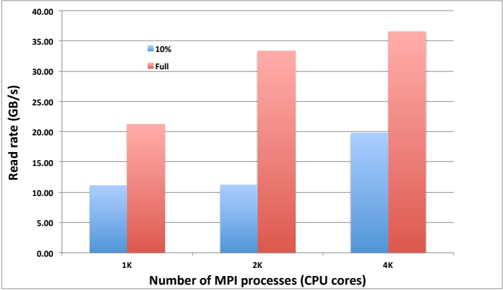

Fig. 9. Read rate of BD-CATS benchmark reading subfiles at different scales from the global cscratch file system, from the Edison system. The first bar is the performance of reading 10% of the particles at random locations, and the second bar is that of reading all the particles.

<!-- image -->

## B. Tuning subfiling

1) Number of subfiles: In Figure 10, we demonstrate that the subfiling factor has a significant impact on the I/O rate in writing data from Edison to 'scratch3'. We have used 4K MPI processes in this evaluation. We show the I/O rate achieved with different subfiling factors and the average I/O rate. This plot reveals that using small as well as large subfiling factors, i.e., writing too many or too few subfiles, respectively, performs poorly. We observe that using subfiling factors of 8 to 1024, for a 4K processes achieves above average I/O performance, and using 8, 16, or 32 as subfiling factor obtains the best performance.

In figures 11 and 12, we show the impact of varying subfiling factors writing data from Edison and Cori to the 'cscratch' file system, respectively. While writing a large number of subfiles does not impact performance significantly on this file system, writing a small number of files have a severe impact on performance. Using a subfile factor of 8 to 32 obtained the superior performance compared to the other value for this configuration. Performance of writing different numbers of subfiles to the burst buffer on Cori (Figure 13) has mostly similar behavior as that of writing from Cori nodes to 'cscratch'. The main deviation from the trend is that writing large number of files, i.e., subfiling factors of 1, 2, and 4 obtain similar performance as that of the factors equal to 8 to 128. The I/O rate degrades with writing smaller numbers of subfiles as expected.


Fig. 10. Observed I/O rate with VPIC-IO writing different numbers of subfiles with 4K processes on Edison to the scratch3 Lustre file system.

<!-- image -->

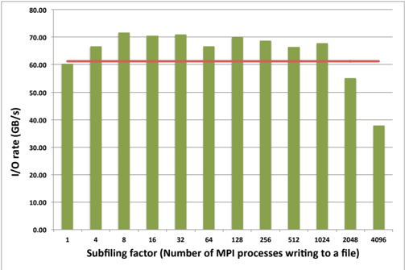

Fig. 11. Observed I/O rate with VPIC-IO writing different numbers of subfiles with 4K processes on Edison to the Global cscratch file system.

<!-- image -->

2) Storage layout tuning: In order to find an optimal number of Lustre stripe configuration for subfiles, we have measured performance of writing 32 subfiles from 4K MPI processes. We have varied the stripe count used on 'cscratch' from 1 to 248. Up to 128, we have incremented the count by multiples of two. We have set the stripe size to be 32MB as each process is writing that amount of data pertaining to 8 ∗ 1024 ∗ 1024 particles. We have also compared the performance with default stripe setting, which is equal to a stripe count of 1 and a stripe size of 1MB.


Figure 14 shows the I/O rate with varying stripe counts on 'cscratch' for data generated on Edison nodes. Figure 15 shows the same performance for the data generated on Cori Haswell nodes. In both cases, default Lustre settings obtain poor performance. This is obvious because the small stripe size requires more I/O requests from each process and serving larger number of requests results in poor performance. While there was no clear consensus on selecting the number of OSTs,

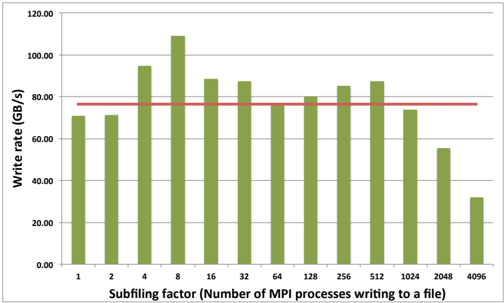

Fig. 12. Observed I/O rate with VPIC-IO writing different numbers of subfiles with 4K processes on Cori Haswell partition, to the Global cscratch file system.

<!-- image -->

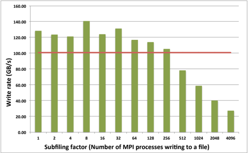

Fig. 13. Observed I/O rate with VPIC-IO writing different numbers of subfiles with 4K processes on Cori Haswell partition, to the burst buffer file system.

<!-- image -->

using 8, 16, 32, and 64 OSTs have similar performance.

In Figure 16, we have explored the stripe settings of 'cscratch' further by measuring the I/O rate of writing 64 subfiles from 16K MPI processes on Cori Haswell partition. As mentioned above, we have set the stripe size to be 32MB as each process is writing that amount of data pertaining to 8 ∗ 1024 ∗ 1024 particles. The default stripe settings use 1 OST with 1MB stripe size. The total amount of data written by VPIC-IO is equal to 4096GB and the number of subfiles with 64 processes writing to a subfile is 256. Each subfile is of size 16GB. When writing with 16K cores, higher stripe count was beneficial. With 64 and 128 OSTs, we have observed the best I/O rate.

## VI. CONCLUSIONS

In this paper, we have described the current implementation of the subfiling feature in HDF5. Our evaluation on three file systems shows an I/O performance improvement of up to 6.5X with subfiling. We have also analyzed performance sensitivity of the feature with choices for the number of subfiles and the number of Lustre stripe counts. Based on our

<!-- image -->

Fig. 14. Observed I/O rate with VPIC-IO writing 32 subfiles with 4K processes from Edison to the 'cscratch' file system. The file system has 248 OSTs.

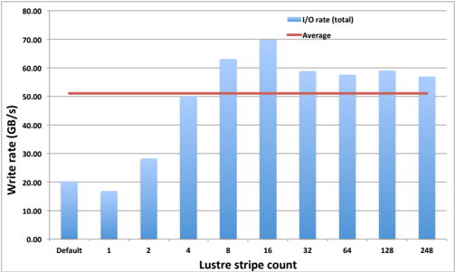

Fig. 15. Observed I/O rate with VPIC-IO writing 32 subfiles with 4K processes from Cori Haswell partition to the 'cscratch' file system..

<!-- image -->

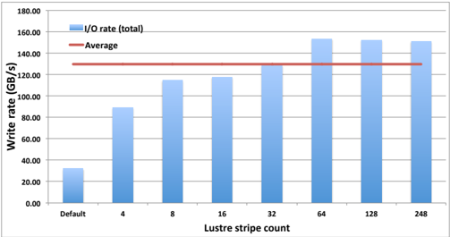

Fig. 16. Observed I/O rate with VPIC-IO writing 64 subfiles with 16K processes from Cori Haswell partition to the 'cscratch' file system.

<!-- image -->

observations, we summarize the following recommendations and report the limitations of using the feature.

## A. Recommendations

- The main goal of subfiling is to have fewer number of files to be dealt with. To achieve that goal, we suggest setting the subfiling factor of 8 to 64, which obtains good I/O performance as well as fewer files to manage.
- We suggest setting the stripe size to be 8 or 16 on Cori's 'cscratch' file system to obtain good I/O performance at smaller scales, such as 4K processes. At larger scales, such as 16K cores, we have observed that striping the subfiles on larger number of OSTs obtains better write performance.

## B. Limitations

We have observed the following limitations in the current implementation of the subfiling feature, which requires HDF5 developers to work on resolving.

- Subfile datasets are always one-dimensional and use contiguous storage.
- Using subfiling feature with 32K MPI processes failed with the following error: H5Fsuper.c:1083: H5F\_super\_dirty: Assertion 'f-&gt;shared-&gt;sblock' failed.

## REFERENCES

- [1] BD-CATS-IO benchmark. https://github.com/glennklockwood/bdcats-io.

- [2] BoxLib. https://ccse.lbl.gov/BoxLib/.

- [3] Parallel I/O Kernel suite (PIOK). https://code.lbl.gov/projects/piok/.

- [4] J. Bent, G. Gibson, G. Grider, B. McClelland, P. Nowoczynski, J. Nunez, M. Polte, and M. Wingate. Plfs: A checkpoint filesystem for parallel applications. In Proceedings of the Conference on High Performance Computing Networking, Storage and Analysis , SC '09, pages 21:121:12, 2009.

- [5] K. J. Bowers, B. J. Albright, L. Yin, B. Bergen, and T. J. T. Kwan. Ultrahigh performance three-dimensional electromagnetic relativistic kinetic plasma simulation. Physics of Plasmas , 15(5):7, 2008.

- [6] M. Ester, H.-P. Kriegel, J. Sander, and X. Xu. 'a density-based algorithm for discovering clusters a density-based algorithm for discovering clusters in large spatial databases with noise'. In 'Proceedings of the Second International Conference on Knowledge Discovery and Data Mining' , KDD'96, pages 226-231, 1996.

- [7] K. Gao, W.-k. Liao, A. Nisar, A. Choudhary, R. Ross, and R. Latham. 'using subfiling to improve programming flexibility and performance of parallel shared-file i/o'. In Proceedings of the 2009 International Conference on Parallel Processing , ICPP '09, pages 470-477, 2009.

- [8] D. Henseler, B. Landsteiner, C. Wright, and N. J. Wright. Architecture and Design of Cray DataWarp. In Proceedings of 2016 Cray User Group , May 2016.

- [9] M. Howison, A. Adelmann, E. W. Bethel, A. Gsell, B. Oswald, and Prabhat. H5hut: A High-Performance I/O Library for Particle-Based Simulations. In Proceedings of 2010 Workshop on Interfaces and Abstractions for Scientific Data Storage (IASDS10) , Heraklion, Crete, Greece, Sept. 2010. LBNL-4021E.
- The limitation on the number of subfiles was observed to vary with total number of MPI tasks, and successful runs with 64 subfiles were observed up to 504 tasks on 21 nodes, yet failure occurs at higher task and node count. The failure message in these instances:

- [10] Q. Liu, J. Logan, Y. Tian, H. Abbasi, N. Podhorszki, J. Y. Choi, S. Klasky, R. Tchoua, J. Lofstead, R. Oldfield, M. Parashar, N. Samatova, K. Schwan, A. Shoshani, M. Wolf, K. Wu, and W. Yu. 'hello adios: The challenges and lessons of developing leadership class i/o frameworks'. Concurr. Comput. : Pract. Exper. , 26(7):1453-1473, May 2014.

- [11] M. M. A. Patwary, S. Byna, N. R. Satish, N. Sundaram, Z. Luki´ c, V. Roytershteyn, M. J. Anderson, Y. Yao, Prabhat, and P. Dubey. 'bdcats: Big data clustering at trillion particle scale'. In 'Proceedings of the International Conference for High Performance Computing, Networking, Storage and Analysis' , 'SC '15', pages 6:1-6:12, 2015.

- [12] U. Pedersen and M. S. Breitenfeld. HDF5 writer performance review . http://confluence.diamond.ac.uk/display/HDF5DEV/HDF5+ writer+performance+review.

- [13] The HDF Group. HDF5 user guide. http://hdf.ncsa.uiuc.edu/HDF5/doc/ H5.user.html, 2010.
- Failure was observed for region sizes of 2GB or greater.
- The number of reader processes and the subfiling factor have to match those used for writing the files. Supporting arbitrary number of reader processes and subfiling factors is beneficial.

```
Rank 664 [Mon Apr 24 18:30:14 2017] [c00c1s9n0] Fatal error in PMPI_Bcast: Invalid root, error stack: PMPI_Bcast(1614): MPI_Bcast (buf=0x7fffffff5ab8, count=1, MPI_INT, root=1389571432,comm=0xc4000002) failed PMPI_Bcast(1576): Invalid root (value given was 1389571432)
```

## ACKNOWLEDGMENT

This work is supported by the Director, Office of Science, Office of Advanced Scientific Computing Research, of the U.S. Department of Energy under Contract No. DE-AC0205CH11231 (Project: ExaHDF5, Program manager: Dr. Lucy Nowell). This research used resources of the National Energy Research Scientific Computing Center, a DOE Office of Science User Facility supported by the Office of Science of the U.S. Department of Energy under Contract No. DE-AC0205CH11231.