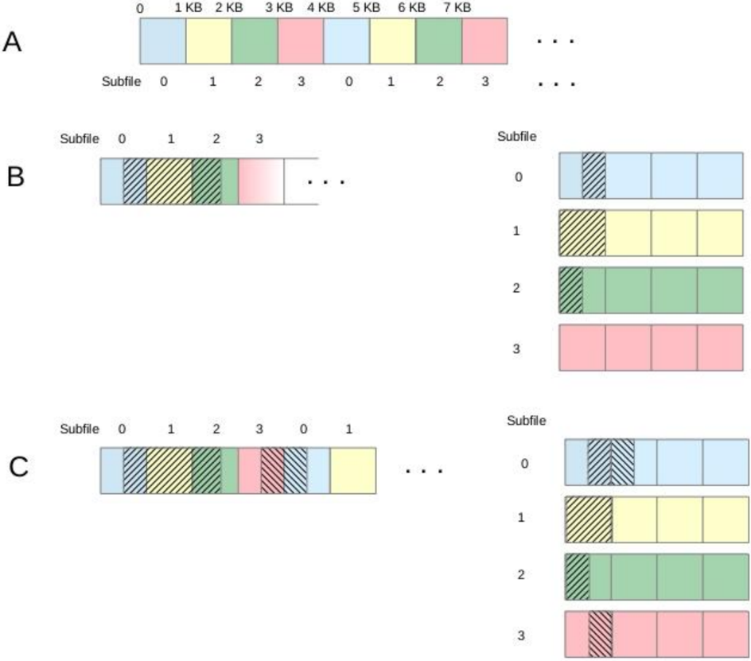

## RFC:	VFD	Sub-filing

## John	Mainzer

The	 initial	 sub-filing	 prototype	 is	 based	 on	 virtual	 data	 sets 1 .	 	 While	 this	 prototype functions,	and	demonstrates	significant	performance	gains 2 ,	it	has	performance	issues when	restoring	a	file	with	a	different	number	of	processes,	and	can't	readily	handle the	 case	 in	 which	 a	 process	 writes	 to	 an	 un-expected	 section	 of	 the	 virtual	 dataset. Due	to	these	and	other	deficiencies,	the	initial	prototype	has	been	abandoned.

This	RFC	proposes	two	closely	related	alternate	approaches	to	implementing	sub-filing in	HDF5	that	avoid	these	deficits.		In	both	cases,	the	basic	idea	is	to	implement	subfiling	at	the	VFD	layer,	thus	hiding	it	from	the	upper	levels	of	the	HDF5	library.

The	 first	 approach	 (R/W	 VFD	 sub-filing)	 distributes	 the	 logical	 HDF5	 file	 across	 a collection	of	sub-files,	with	I/O	directed	to	the	appropriate	sub-file	via	a	system	of	I/O concentrators	-	either	dedicated	ranks	or	threads	off	of	compute	ranks.

The	 second	 approach	 (W/O	 VFD	 sub-filing)	 uses	 a	 system	 of	 sub-files	 and	 I/O concentrators	to	journal	raw	data	writes.	While	this	makes	raw	data	un-readable	until after	the	journals	have	been	run,	it	forces	all	ranks	to	write	only	to	their	designated	I/O concentrators	 -	 thus	 making	 it	 possible	 to	 avoid	 raw	 data	 I/O	 related	 off	 node	 IPC when	node-local	storage	is	available	for	the	sub-files.		Metadata	is	stored	as	usual	in the	HDF5	file,	and	raw	data	becomes	available	after	the	journals	in	the	sub-files	are applied	to	the	HDF5	file.

## 1 Introduction

The	basic	idea	behind	sub-filing	is	to	find	the	middle	ground	between	single	shared	file	and	one	file per	process	-	thereby	avoiding	some	of	the	complexity	of	one	file	per	process,	and	minimizing	the locking	issues	of	a	single	shared	file	on	a	parallel	file	system.

This	idea	can	be	implemented	in	many	ways,	ranging	from	requiring	each	rank	to	perform	I/O	directly to	its	assigned	sub-file,	to	mapping	one	or	more	I/O	concentrator	processes	per	sub-file,	and	relaying I/O	from	the	ranks	that	access	that	sub-file	through	the	I/O	concentrators.

As	 the	 optimal	 implementation	 is	 machine-specific,	 flexibility	 and	 configurability	 must	 be	 a	 major design	goal	in	any	implementation	of	sub-filing	in	HDF5.

## 1. Described	in	the	RFC	titled	'Sub-filing	in	HDF5	Using	Virtual	Datasets.'

## 2. Discussed	in	section	11	of	the	above	mentioned	RFC.

<!-- image -->

## 1.1 The	Existing	Sub-Filing	Prototype

The	initial	sub-filing	prototype	is	tightly	tied	to	the	recently	developed	Virtual	Data	Set	(VDS)	feature in	HDF5.		Indeed,	it	is	best	understood	as	an	extension	of	VDS	to	parallel	HDF5.		As	a	result,	each	subfile	contains	one	of	the	source	datasets	that	comprise	a	virtual	dataset,	and	any	rank	that	wishes	to write	to	the	portion	of	the	virtual	dataset	represented	by	a	given	source	dataset	must	open	the	subfile	that	contains	it.		As	the	whole	point	of	sub-filing	is	to	limit	the	number	of	ranks	accessing	each sub-file	so	as	to	minimize	contention,	practically	speaking,	this	makes	it	difficult	if	not	impossible	for	a virtual	dataset	based	approach	to	sub-filing	to	efficiently	handle	the	case	in	which	one	or	more	ranks write	 to	 un-expected	 portions	 of	 the	 virtual	 dataset.	 	 The	 same	 basic	 issue	 appears	 when	 a checkpoint	 file	 reload	 with	 a	 different	 number	 of	 ranks	 results	 in	 reads	 involving	 multiple	 source datasets.		While	the	initial	prototype	handles	this	case,	it	does	so	by	allowing	the	ranks	to	open	subfiles	as	needed	-	at	the	cost	of	using	only	independent	I/O	for	the	reload.

A	 further	 problem	 with	 the	 initial	 prototype	 is	 the	 lack	 of	 support	 for	 I/O	 concentrators	 --	 all processes	that	write	to	a	given	sub-file	must	open	it.		As	shall	be	seen,	this	is	an	issue	with	the	HDF5 library,	and	not	specific	to	the	initial	sub-filing	prototype.

## 1.2 Limitations	of	the	Existing	HDF5	Library	I/O	Infrastructure

The	 HDF5	 library	 requires	 all	 I/O	 to	 pass	 through	 the	 virtual	 file	 driver	 (VFD)	 abstraction	 layer. Conceptually,	the	VFD	layer	presents	the	underlying	storage	system	as	an	extensible	vector	of	bytes, and	hides	most	of	the	implementation	details	from	the	upper	levels	of	the	HDF5	library.		Historically, this	abstraction	layer	has	been	used	to	allow	the	HDF5	library	to	run	on	different	operating	systems with	different	file	I/O	APIs,	to	simulate	large	files	on	file	systems	with	a	2	GB	max	file	size,	and	to segregate	metadata	and	raw	data	into	separate	files.		More	recent	applications	include	supporting object	stores,	remote	mirroring	of	HDF5	files	as	they	are	written,	tracking	changes	to	an	HDF5	file, and	an	alternate	implementation	of	SWMR	(Single	Writer	Multiple	Readers).

While	the	value	of	this	abstraction	layer	has	been	well	demonstrated,	the	public	read	and	write	calls (signatures	shown	below)	are	essentially	the	UNIX	system	calls	of	similar	name	with	the	addition	of parameters	specifying	memory	type,	and	a	property	list.

```
herr_t H5FDread(H5FD_t *file, H5FD_mem_t type, hid_t dxpl_id, haddr_t addr, size_t size, void *buf/*out*/); herr_t H5FDwrite(H5FD_t *file, H5FD_mem_t type, hid_t dxpl_id, haddr_t addr, size_t size, const void buf /*in*/);
```

As	can	be	seen	from	the	above	signatures,	these	I/O	calls	require	the	upper	levels	of	the	HDF5	library to	 break	 the	 I/O	 requests	 generated	 by	 any	 given	 HDF5	 API	 call	 into	 a	 sequence	 of	 offset,	 length, buffer	triplets,	and	pass	them	to	the	VFD	layer	in	individual	calls.		This	is	a	good	match	for	most	local file	 systems,	 but	 it	 is	 inadequate	 when	 knowledge	 of	 the	 entire	 I/O	 request	 is	 necessary	 for performance.		For	example,	with	the	current	VFD	API,	a	given	rank	would	have	to	send	a	separate message	to	the	appropriate	I/O	concentrator	for	each	offset,	length,	buffer	triplet	in	the	I/O	request, instead	of	bundling	them	up	in	a	single	message.

<!-- image -->

The	list	of	known	use	cases	where	the	existing	public	VFD	interface	is	inadequate	include:

## 1. MPI	I/O
## 2. Efficient	I/O	on	long	latency	storage	subsystems	(i.e.	S3).
## 3. Support	for	the	topology-aware	VFD	developed	by	ANL
## 4. Efficient	support	for	I/O	concentrators	in	sub-filing

The	 HDF5	 library	 supports	 the	 MPI	 I/O	 use	 case	 by	 constructing	 MPI	 derived	 types	 describing	 the required	I/O	in	the	upper	levels	of	the	library,	and	passing	them	down	to	the	MPI	I/O	VFD	via	undocumented	channels.		While	this	solution 3 imposes	extra	complexity	on	the	upper	levels	of	the	HDF5 library,	and	has	problems	from	a	modularity	and	separation	of	concerns	perspective,	it	has	worked for	over	a	decade.

Unfortunately,	this	solution	is	not	readily	extensible	to	the	other	use	cases,	as	interrogation	of	MPI derived	types	requires	access	to	MPI	library	internals.

The	bottom	line	here	is	that	if	we	want	efficient	support	for	I/O	concentrators,	we	have	to	repair	this deficit	in	the	current	VFD	layer	implementation,	and	update	the	rest	of	the	library	accordingly. 4 As might	be	expected	from	the	above	list	of	use	cases	for	an	enhanced	version	of	the	VFD	layer,	this	is	a problem	that	has	been	known	for	some	time,	and	there	is	an	RFC	in	progress	to	address	the	issue entitled	'RFC:	Selection	I/O.'

The	details	of	the	selection	I/O	RFC	are	largely	beyond	the	scope	of	this	RFC,	but	a	general	overview	is necessary.

From	the	perspective	of	the	VFDs,	it	 would	 be	 best	 to	 receive	 descriptions	 of	 the	 I/O	 requests	 as vectors	of	offset,	length,	buffer	triplets.		Call	this	approach	'vector	I/O'.		While	there	are	sections	of

## 3. Which	appears	to	have	been	introduced	in	HDF5	1.8.

## 4. Strictly	speaking,	for	sub-filing	proper	this	isn't	true.

Another	 approach	 is	 to	 create	 a	 new	 sub-filing	 dataset	 type	 (in	 addition	 to	 contiguous,	 chunked, compact,	etc.),	and	implement	sub-filing	at	the	dataset	level.		On	the	plus	side,	this	approach	allows easier	implementation	of	I/O	concentrators	as	it	bypasses	the	need	for	refactoring	the	existing	raw data	I/O	pathways	as	described	in	the	text.

However,	it	also	creates	a	second	raw	data	I/O	pathway	separate	from	that	used	by	the	rest	of	the library,	with	the	obvious	software	engineering	and	maintenance	issues.

Further,	 only	 the	 new	 dataset	 type	 would	 be	 useable	 with	 sub-filing.	 For	 instance,	 if	 parallel compression	is	desired	in	sub-files,	it	will	have	to	be	re-implemented	in	the	context	of	the	sub-filing dataset	 type	 instead	 of	 just	 using	 the	 existing	 parallel	 compression	 code	 that	 works	 with	 chunked datasets.

These	 deficits, combined	 with	 the	 relative inflexibility	 of	 the	 approach,	 and	 the	 unknowns surrounding	future	HPC	machine	architecture,	make	this	approach	a	non-starter.

<!-- image -->

the	HDF5	library	for	which	this	is	either	convenient	or	preferable	(i.e.	the	metadata	cache,	the	page buffer 5 ,	 the	 parallel	 compression	 code,	 and	 the	 chunk	 cache 6 ),	 it	 is	 not	 practical	 in	 general	 due	 to memory	footprint	concerns.

Thus	in	addition	to	the	vector	I/O	extensions	to	the	VFD	API,	it	will	also	be	necessary	to	extend	the existing	selection	code	to	support	conversion	of	selections	on	datasets	into	selections	on	the	file	(that is,	onto	a	vector	of	bytes),	and	extend	the	VFD	interface	to	accept	I/O	requests	described	as	vectors of	such	selections.		Call	this	approach	'selection	I/O'	proper.

In	both	cases,	the	upper	levels	of	the	HDF5	library	will	have	to	be	refactored	to	use	the	extended	VFD interface,	and	the	MPI	I/O	VFD	will	have	to	be	modified	to	construct	the	needed	MPI	derived	types	on receipt	of	vector	and	selection	I/O	calls.

Further,	 since	 the	 vector	 and	 selection	 I/O	 calls	 are	 irrelevant	 to	 VFD's	 that	 can't	 use	 them	 to optimize	I/O,	the	VFD	layer	must	be	modified	to	convert	vector	and	selection	I/O	calls	into	sequences of	POSIX	like	calls	when	desired.

As	should	be	evident	from	the	above,	implementation	of	vector	and	selection	I/O	in	the	HDF5	library will	be	mostly	a	refactoring	exercise,	which	should	simplify	the	raw	data	pathways	in	the	upper	levels of	the	HDF5	library	considerably.		That	said,	it	is	not	a	trivial	exercise,	as	the	current	work	around	for MPI	I/O	has	existed	for	three	major	versions	of	the	HDF5	library,	and	has	become	heavily	embedded in	the	code.

However,	for	purposes	of	an	initial	working	prototype	of	sub-filing,	it	is	not	necessary	to	implement both	vector	and	selection	I/O.		Vector	I/O	is	much	easier	than	selection	I/O,	and	it	should	allow	us	to demonstrate	parallel	compression	in	sub-filing	in	an	initial	prototype,	with	selection	I/O	proper	left for	later	implementation.

## 1.3 Why	VFD	Sub-Filing

The	basic	idea	behind	VFD	sub-filing	is	to	hide	sub-filing	in	the	VFD	layer	to	the	extent	possible,	which it	does	by	striping 7 the	logical	single	shared	HDF5	file	across	the	sub-files.		In	addition	to	the	obvious modularity,	 separation	 of	 concerns,	 and	 maintainability	 benefits,	 this	 approach	 has	 the	 following advantages:

1. All	current	and	future	features	of	parallel	HDF5	will	be	useable	with	VFD	sub-filing	with	little or	no	extra	development	work.

5 At	 present	 the	 page	 buffer	 is	 disabled	 in	 the	 parallel	 case.	 	 However,	 as	 has	 been	 observed elsewhere,	 extension	 of	 the	 page	 buffer	 to	 the	 parallel	 case	 should	 allow	 us	 to	 solve	 the	 small metadata	I/O	problem	since	it	would	allow	us	to	aggregate	metadata	into	pages	of	convenient	size for	 parallel	 file	 systems	 (i.e.	 1	 MiB)	 -	 thus	 making	 metadata	 I/O	 largely	 indistinguishable	from	raw data	I/O.

6 The	chunk	cache	is	disabled	in	the	parallel	case	due	to	fundamental	cache	coherency	issues.		While these	could	be	addressed	through	a	distributed	cache	scheme,	there	are	no	plans	in	progress	for	this.

7 This	is	a	bit	of	an	over-simplification.		While	it	is	true	for	the	proposed	initial	implementation,	other methods	of	distributing	the	logical	HDF5	file	across	the	sub-files	are	possible,	and	may	be	desirable	in later	versions.

<!-- image -->

2. Implementing	selection	I/O	and	moving	sub-filing	to	the	VFD	layer	gives	us	a	great	deal	of flexibility	to	adapt	to	future	architectures.

First,	it	allows	us	to	build	I/O	concentrators	on	top	of	the	VFD	interface,	allowing	us	to	use	any applicable	current	or	future	VFDs	for	I/O	at	the	concentrator	level.

Second,	in	cases	in	which	I/O	concentrators	are	not	optimal,	this	architecture	allows	easy adoption	of	alternate	solutions.

For	example,	a	version	of	the	current	MPI	I/O	VFD	updated	to	support	selection	I/O	could	be used	to	easily	implement	a	version	of	sub-filing	were	each	sub-file	is	opened	and	accessed directly	by	all	processes	assigned	to	it	-	thus	avoiding	threads	or	dedicated	ranks	for	the concentrators.		As	per	the	existing	prototype,	the	basic	version	of	this	solution	requires	that each	rank	writes	raw	data	only	to	its	assigned	sub-file.	This	constraint	could	be	relaxed,	but that	will	add	significantly	to	the	development	effort	required.

Third,	when	and	where	available,	UnifyFS	will	likely	provide	a	W/O	solution	that	is	better	for most	purposes	than	the	W/O	sub-filing	approach	discussed	in	this	document.		Implementation of	selection	I/O	should	allow	us	to	restore	the	MPI	/	POSIX	VFD,	which	is	the	obvious	VFD	to use	to	write	raw	data	to	UnifyFS

## 3. VFD	sub-filing	provides	for	flexible	management	of	sub-files.

In	addition	to	the	trivial	re-construction	of	the	single	shared	HDF5	file	(required	to	read	the raw	data	in	the	W/O	case),	it	also	makes	it	easy	to	change	the	number	of	sub-files.		Note	that this	can	be	done	without	copying	any	existing	data	if	the	number	of	sub-files	is	to	be increased.

Finally,	it	allows	segregation	of	metadata	in	a	single	sub-file	(with	duplicates	if	desired), making	it	possible	to	recover	as	much	data	as	possible	in	the	corrupted	sub-file	case	as	long	as the	metadata	sub-file(s)	are	not	all	corrupted.

The	 major	 down	 side	 of	 VFD	 sub-filing	 is	 the	 dependency	 on	 the	 selection	 I/O	 refactoring	 effort. Fortunately,	 selection	 I/O	 is	 needed	 for	 several	 other	 purposes,	 which	 creates	 opportunities	 for sharing	the	implementation	costs.

The	dependency	on	selection	I/O	also	introduces	schedule	concerns.		As	mentioned	above,	the	initial VFD	sub-filing	prototype	can	bypass	selection	I/O	proper.		However,	selection	I/O	proper	is	necessary for	a	full	VFD	sub-filing	implementation	-	which	presents	a	significant	scheduling	concern.

While	the	above	maintainability	and	adaptability	benefits	are	hard	to	argue	with,	the	financial	and schedule	 concerns	 implicit	 in	 the	 selection	 I/O	 dependency	 are	 significant	 and	 must	 be	 managed. That	said,	absent	a	cheaper	solution	with	comparable	advantages,	VFD	sub-filing	seems	to	be	the	best available	option.

## 1.4 Outline	of	this	Document

Section	2	contains	detailed	sketch	designs	of	the	two	versions	of	VFD	sub-filing,	and	is	intended	to provide	 both	 a	 conceptual	 overview,	 and	 a	 general	 plan	 for	 implementation.	 	 Note	 that	 many technical	details	are	left	unresolved.

<!-- image -->

Section	3	is	currently	unpopulated.		As	development	of	VFD	sub-filing	proceeds,	it	should	document the	resolution	of	technical	issues	left	un-resolved	in	section	2,	and	define	the	function	and	design	of all	the	code	necessary	to	implement	VFD	sub-filing.		Note	that	this	section	(and	probably	section	2	as well)	will	evolve	as	implementation	proceeds,	and	unforeseen	issues	are	addressed.

Section	4	is	currently	unpopulated.		When	VFD	sub-filing	is	fully	implemented,	section	4	will	address code	organization	and	other	implementation	details	needed	for	maintenance	purposes.

Section	 5	 is	 currently	 unpopulated.	 	 As	 implementation	 proceeds,	 it	 should	 be	 updated	 to	 discuss functional	and	performance	testing	of	VFD	sub-filing.

## 2 Conceptual	Overview

This	section	presents	detailed	sketch	designs	for	R/W	and	W/O	VFD	sub-filing.		It	also	includes	a	list	of tasks	required	to	implement	the	basic	version	of	R/W	VFD	sub-filing.		This	latter	section	will	likely	be deleted	as	the	design	work	listed	is	completed	and	documented	in	section	3.

## 2.1 R/W	VFD	Sub-Filing

R/W	VFD	sub-filing	distributes	the	logical	HDF5	file	across	a	collection	of	sub-files.	While	this	design choice	is	driven	by	the	objective	of	hiding	sub-filing	from	the	upper	levels	of	the	library,	it	has	other advantages	as	discussed	in	section	1.3	above

Routing	of	I/O	requests	to	the	appropriate	sub-files	is	managed	via	per	rank	sub-filing	VFDs,	and	a system	of	I/O	concentrators,	combined	with	selection	I/O.		Briefly,	selection	I/O	allows	the	sub-filing VFDs	to	examine	each	I/O	request	as	a	whole,	determine	which	sub-files	are	involved,	sub-divide	the request	accordingly,	and	route	the	sub-requests	to	the	appropriate	I/O	concentrators.

Obviously,	this	implies	large	amounts	of	raw	data	I/O	related	IPC	between	the	compute	ranks	and	the I/O	concentrators.		In	the	ideal	case,	the	compute	rank	and	the	target	I/O	concentrator	are	always	on the	same	node,	minimizing	the	cost	of	this	IPC.		The	importance	of	approaching	this	ideal	will	depend on	the	cost	of	internode	IPC	on	the	target	machines. 8

If	 which	 rank	 writes	 to	 what	 portions	 of	 the	 target	 dataset	 is	 fundamentally	 unpredictable,	 the problem	of	minimizing	off	node	IPC	for	raw	data	I/O	purposes	is	un-solvable,	and	thus	must	be	lived with.

However,	 in	 the	 checkpoint	 file	 use	 case,	 applications	 whose	 write	 behavior	 is	 well	 known	 are common.		In	such	cases,	and	where	node-local	storage	is	used	for	the	sub-files,	there	will	be	at	least some	advantage	in	avoiding	IPC	with	off	node	I/O	concentrators.

At	 a	 minimum,	 this	 requires	 the	 appropriate	 binding	 of	 sub-files,	 I/O	 concentrators,	 and	 compute ranks	to	nodes.		It	also	requires	appropriate	allocation	of	logical	HDF5	file	space	to	sub-files.

8 My	own	intuition	on	the	matter,	and	comments	on	earlier	versions	of	this	document	both	suggest that	this	is	highly	unlikely	to	be	a	significant	issue	-	at	least	on	high	end	machines.		That	said,	it	seems prudent	to	consider	the	issue,	examine	possible	solutions,	and	not	foreclose	them	needlessly.		Even	if minimizing	off	node	IPC	costs	is	a	non-issue	now,	future	developments	could	re-open	the	question.

<!-- image -->

While	this	appears	to	be	do-able	with	appropriate	cooperation	from	the	application,	depending	on the	level	of	optimization	required,	it	has	the	potential	to	add	considerably	to	the	complexity	of	the problem.		Further,	as	shall	be	seen,	the	issue	can	be	bypassed	with	the	W/O	version	of	VFD	sub-filing.

Thus,	in	this	 conceptual	outline	of	R/W	VFD	sub-filing,	we	first	address	address	the	simple	case	in which	 we	 do	 not	 attempt	 to	 minimize	 raw	 data	 related	 IPC	 costs,	 and	 then	 outline	 possible optimizations.

## 2.1.1 Base	Version	of	R/W	VFD	Sub-filing

In	the	base	version	of	R/W	VFD	sub-filing,	we	simply	stripe	the	logical	HDF5	file	across	the	sub-files, and	 redirect	 I/O	 requests	 to	 the	 appropriate	 sub-file(s).	 Doing	 this	 efficiently	 (i.e.	 minimizing	 the number	of	message	exchanges	with	I/O	concentrators)	requires	selection	I/O.

Since	 there	 is	 no	 attempt	 to	 minimize	 the	 cost	 of	 inter-process	 communications	 with	 the	 I/O concentrators	in	the	base	version,	we	can	hide	sub-filing 9 from	the	HDF5	library	above	the	VFD	layer. Thus	the	base	version	requires	only	the	following	major	components:

1. The	sub-filing	VFDs,	which	examine	I/O	requests,	sub-divide	them	as	necessary,	and	relay them	to	the	appropriate	I/O	concentrator(s).		The	sub-filing	VFDs	also	maintain	an	index detailing	the	mapping	of	the	logical	HDF5	file	onto	the	sub-files.		In	the	base	case,	this	simply means	storing	the	stripe	depth	and	width,	so	that	any	offset	in	the	logical	file	can	be	mapped to	the	appropriate	offset	in	one	of	the	sub-files.
2. The	constellation	of	I/O	concentrators,	which	serve	I/O	requests	on	their	assigned	sub-files. The	I/O	concentrators	are	either	dedicated	ranks	or	threads	off	of	compute	ranks.		To maximize	code	re-use,	they	use	the	HDF5	VFD	layer	to	perform	actual	operations	on	the	subfiles.
## 3. Configuration,	setup	and	takedown	code	for	the	I/O	concentrators.

To	handle	I/O	requests	efficiently	and	correctly,	the	sub-filing	VFDs	require	the	following:

1. A	description	of	the	entire	I/O	request	generated	by	the	API	call	-	probably	in	the	form	of	a selection	on	the	vector	of	bytes	that	comprises	the	logical	HDF5	file,	and	an	associated	buffer.

This	is	provided	by	selection	I/O.

2. An	index	mapping	the	logical	HDF5	file	to	locations	in	the	sub-files.		In	the	base	version,	we will	simply	stripe	the	logical	HDF5	file	across	the	sub-files,	and	thus	we	can	compute	this	index as	needed	given	the	stripe	width	and	depth.

This	is	constructed	on	each	rank	as	logical	file	space	is	allocated	and	assigned	to	its	target	subfile.		In	the	basic	case	this	is	very	simple,	as	the	logical	HDF5	file	is	simply	striped	across	the sub-files.		As	shall	be	seen,	this	becomes	more	complex	once	we	try	to	minimized	interprocess	communication	costs	through	file	space	allocation	based	on	hints	and	mapping	of ranks	to	nodes	and	cores.

3. For	each	sub-file,	the	rank	of	the	process	to	which	I/O	for	that	sub-file	should	be	redirected, and	any	other	information	that	is	needed	to	perform	the	needed	communications.

## 9. With	the	exception	of	code	to	pass	through	configuration	data.

<!-- image -->

In	the	basic	case,	this	configuration	data	will	be	passed	in	as	a	FAPL	(File	Access	Property	List) entry	during	file	open.		As	above,	this	may	change	as	we	attempt	to	minimized	inter-process communications	costs.


Figure	1:		A	diagram	of	a	possible	base	version	VFD	sub-filing	configuration.		Here	we	assume	N	ranks	distributed	across	M	nodes, where	each	node	has	node-local	storage.		For	each	node,	we	have	one	I/O	concentrator,	that	accesses	its	local	sub-file	via	the	sec2 VFD.		The	lines	between	the	sub-filing	VFDs	and	the	I/O	Concentrators	denote	potential	lines	of	communication.

<!-- image -->

The	I/O	concentrators	require	configuration	data	specifying:

1. The	number,	location,	and	names	of	the	sub-files,
2. The	number,	and	location	of	the	I/O	concentrators,
## 3. The	assignment	of	I/O	concentrators	to	sub-files,	and
## 4. Specification	of	how	data	is	to	be	written	to	the	assigned	sub-file	-	i.e.	POSIX	or	MPI	I/O,	etc.

If	the	I/O	concentrators	are	threads	off	of	compute	ranks,	this	data	can	again	be	passed	in	the	FAPL, and	the	necessary	threads	can	be	created	as	part	of	the	file	opening	process.		If	dedicated	ranks	are used,	some	other	method	of	configuration	will	be	necessary.		In	either	case,	the	I/O	concentrators will	use	the	HDF5	VFD	interface	to	perform	the	actual	I/O.

<!-- image -->

For	independent	I/O,	the	cycle	of	operation	of	the	sub-filing	VFDs	is	as	follows:

## 1. Receive	the	selection 10 describing	the	desired	I/O	(item	1)	via	a	function	call.
2. Divide	the	above	selection	into	one	or	more	sub-selections	(and	sub-buffers	for	writes)	--	one for	each	sub-file	touched	by	the	I/O.
## 3. Relay	the	sub-selections	(and	sub-buffers	for	writes)	to	the	appropriate	I/O	concentrators	to perform	the	actual	I/O. 11
4. Await	messages	from	each	of	the	I/O	concentrators	indicating	the	outcome	of	the	I/O	request, and,	for	reads,	the	requested	data.		In	the	read	case,	copy	the	read	data	into	the	buffer associated	with	the	selection	passed	into	the	VFD	in	step	1.		Return	the	result.

Note	 that	 at	 some	 point	 in	 this	 process,	 the	 sub-selections	 must	 be	 mapped	 from	 the	 logical	 file address	 space	 onto	 the	 address	 space	 of	 the	 target	 sub-files.	 If	 the	 I/O	 concentrators	 are implemented	as	threads	off	 of	 compute	 ranks,	 it	 makes	 sense	 to	 do	 this	 before	 relaying	 the	 subselections	 to	 the	 appropriate	 I/O	 concentrators.	 	 If,	 on	 the	 other	 hand,	 the	 I/O	 concentrators	 are implemented	as	dedicated	ranks,	it	may	be	appropriate	to	off-load	this	task	on	them.

Again,	 in	 the	 context	 of	 independent	 I/O,	 the	 I/O	 concentrators	 listen	 for	 I/O	 requests,	 and	 serve them	in	the	order	in	which	they	arrive.

While	there	may	be	multiple	I/O	concentrators	for	each	sub-file,	for	simplicity,	each	sub-filing	VFD has	an	assigned	I/O	concentrator	that	it	uses	for	all	I/O	redirected	to	the	associated	sub-file.		If	load balancing	becomes	an	issue,	this	point	will	be	re-visited.

From	 the	 perspective	 of	 the	 sub-filing	 VFDs,	 collective	 I/O	 is	 handled	 much	 the	 same	 way	 as independent	I/O,	with	the	addition	of	a	scatter/gather	between	steps	2	and	3	above,	in	which	the total	number	of	sub-filing	VFDs	that	have	I/O	requests	for	each	I/O	concentrator	is	determined	and relayed	to	the	I/O	concentrators.

From	the	perspective	of	the	I/O	concentrators,	the	collective	I/O	request	begins	when	it	receives	the number	 of	 participating	 sub-filing	 VFDs.	 	 The	 I/O	 concentrators	 then	 proceed	 according	 to	 the following	cycle	of	operation:

## 1. Wait	until	the	specified	number	of	collective	I/O	request	messages	have	been	received	from the	sub-filing	VFDs
## 2. Combine	the	collective	I/O	requests	into	a	single	operation
3. Perform	the	I/O	request	as	specified	in	the	configuration	data.		If	there	are	multiple	sub-file I/O	processes	for	the	target	sub-file,	this	will	probably	be	a	collective	operation	with	the	other sub-file	I/O	processes	that	perform	I/O	to	the	target	sub-file.

10 Here	the	term	'selection'	is	used	generically.		It	could	be	either	a	vector	of	offset,	length,	buffer triplets	or	a	selection	proper.

11 For	writes,	there	is	no	fundamental	reason	for	the	sub-filing	VFDs	to	wait	for	a	completion	status message.		In	principle,	it	can	return	as	soon	as	the	write	message	is	received	by	the	I/O	concentrator. While	the	possibility	of	asynchronous	writes	is	attractive,	it	raises	interesting	error	reporting	issues. As	these	would	be	a	distraction,	we	note	the	opportunity,	but	leave	it	for	another	time.

<!-- image -->

4. If	the	operation	was	a	write,	report	success/failure	to	the	requesting	sub-filing	VFDs.		If	it	was a	read,	extract	data	from	the	results	of	the	collective	read	and	use	it	to	satisfy	the	read requests	from	the	various	sub-filing	VFDs	that	sent	I/O	requests.

Note	 that	 any	 independent	 I/O	 requests	 received	 after	 step	 1	 must	 be	 queued	 until	 after	 the collective	operation	is	completed.



Figure	2:	Example	writes	to	a	VFD	sub-filed	HDF5	file	in	the	basic	case:

<!-- image -->

- A:	A	logical	HDF5	file	striped	across	four	sub-files	(stripe	width	4)	with	a	stripe	depth	of	1	KB.
- B:		After	a	write	of	2	KB	at	offset	512.	To	perform	this	write,	the	sub-filing	VFD	broke	it	into	three	sub-requests	(512	bytes	at	offset 512,	1024	bytes	at	offset	1024,	and	512	bytes	at	offset	2048),	and	relayed	them	to	the	I/O	concentrators	managing	sub-files	0,	1,	and 2	respectively.
- C:	After	a	second	write	of	1	KB	at	offset	3584.		To	perform	this	write,	the	sub-filing	VFD	broke	it	into	two	sub-requests	(512	bytes	at offset	3584,	and	512	bytes	at	offset	4096)	and	relayed	them	to	the	I/O	concentrators	managing	sub-files	3,	and	0	respectively.

<!-- image -->

Ideally,	 the	 I/O	 concentrators	 should	 be	 dedicated	 ranks.	 	 However,	 as	 this	 is	 typically	 impractical with	existing	applications,	we	must	also	be	able	to	implement	the	I/O	concentrators	as	threads	off the	compute	ranks.

## 2.1.2 Optimizations	to	Minimize	the	Cost	of	Inter-Process	Communications

As	 currently	 understood,	 minimizing	 inter-process	 communications	 costs	 is	 at	 least	 a	 two-part problem.

Part	of	this	problem	is	allocating	logical	file	space	to	sub-files	that	are	'close'	to	the	processes	that are	likely	to	access	it	-	thus	minimizing	IPC	costs.

The	 other	 part	 of	 the	 problem	 is	 assigning	 ranks	 that	 write	 to	 adjacent	 sections	 of	 a	 dataset	 to processors	 (cores)	 that	 are	 'close'	 to	 each	 other	 from	 a	 communications	 perspective,	 selecting processors	that	will	perform	I/O	on	a	given	sub-file	that	are	'close'	to	the	processes	that	will	request I/O	to	the	sub-file,	and	potentially,	placing	the	sub-file	'close'	to	these	processes.

## 2.1.2.1 The	Space	Allocation	Problem

Assuming	we	have	some	measure	of	'closeness'	between	compute	processes	and	I/O	concentrators, and	hints	indicating	which	processes	will	access	which	section	of	the	dataset,	the	space	allocation problem	 resolves	 to	 allocation	 of	 logical	 HDF5	 file	 space	 on	 the	 sub-file	 managed	 by	 the	 I/O concentrator(s)	'closest'	to	the	ranks	most	likely	to	write	to	it.

So	far,	two	ways	of	addressing	this	problem	have	presented	themselves:

The	obvious	way	to	do	this	is	to	expose	the	existence	and	details	of	sub-filing	to	the	HDF5	library	free space	manager	so	that	it	can	use	this	information	in	combination	with	hints	from	the	application	to optimize	 space	 allocation.	 	 Leaving	 aside	 the	 modularity	 concerns,	 this	 appears	 to	 be	 do-able	 but unpleasant	for	chunked	datasets,	and	so	sticky	as	to	likely	be	impractical	for	contiguous	datasets.		On the	plus	side,	given	adequate	hints	and	cooperation	from	the	application,	and	sufficient	knowledge	of sub-filing,	the	HDF5	free	space	manager	is	well	positioned	to	optimize	logical	HDF5	file	space	to	subfile	allocation	so	as	to	minimize	I/O	related	IPC	costs.

A	simpler	and	more	modular	approach	is	to	move	the	logical	HDF5	file	space	to	sub-file	allocation	to the	sub-filing	VFDs,	and	delay	allocation	until	data	is	actually	written	(assuming	only	collective	writes) or	until	a	hint	is	received	from	the	application	-	in	which	case	independent	writes	are	permitted.

These	two	approaches	are	discussed	in	greater	detail	in	the	following	sections.

## 2.1.2.1.1 Exposing	Sub-Filing	to	the	HDF5	Free	Space	Managers

Space	allocation	on	sub-files	to	minimize	I/O	related	IPC	costs	varies	greatly	between	chunked	and contiguous	datasets.		Thus	these	two	cases	are	addressed	individually	in	the	following	sub-sections.

## 2.1.2.1.1.1 The	Space	Allocation	Problem	for	Chunked	Datasets

In	 the	 case	 of	 chunked	 data	 sets,	 for	 each	 chunk,	 we	 determine	 the	 'closeness'	 of	 each	 I/O concentrator	/	sub-file	to	each	process	that	expects	to	write	to	the	chunk	(possibly	weighted	by	the fraction	of	the	chunk	that	each	process	expects	to	access),	and	allocate	the	chunk	from	the	sub-file maximizes	closeness	to	these	processes.

<!-- image -->

Note	 that	 this	 allows	 us	 to	 handle	 the	 case	 in	 which	 chunk	 to	 process	 affinity	 is	 not	 known	 until dataset	creation	or	extension	time.		Further,	if	the	chunk	size	is	small	relative	to	stripe	depth,	we	can continue	to	use	striping	to	distribute	the	logical	file	space	across	the	sub-files.		If	not,	we	will	need	a more	general	mechanism	to	express	the	assignment	of	logical	file	space	to	sub-files.

Finally,	 while	 this	 is	 approach	 is	 conceptually	 simple,	 and	 it	 allows	 awareness	 of	 sub-filing	 to	 be contained	 within	 the	 file	 space	 allocation	 code,	 it	 adds	 significant	 complexity,	 as	 it	 requires maintenance	of	free	lists	for	each	sub-file,	and	requires	the	dataset	creation/extension	code	to	pass the	necessary	hints	through	to	the	free	space	managers	with	file	space	allocation	requests.

## 2.1.2.1.1.2 The	Space	Allocation	Problem	for	Contiguous	Datasets

The	contiguous	data	set	case	is	more	difficult	that	the	chunked	case.		Specifically,	it	requires	us	to:

1. Divide	the	dataset	into	n	slices	across	the	most	slowly	changing	index 12 where	n	==	the number	of	sub-files,
2. Assign	one	slice	to	each	sub-file,
## 3. Divide	the	ranks	into	groups	such	that	the	members	of	the	group	only	write	to	a	single	slice	of the	dataset,	and
4. Bind	the	members	of	each	group	to	nodes	so	as	to	minimize	the	'distance'	between	each member	of	the	group	and	the	sub-file	containing	the	target	slice.

From	the	HDF5	perspective,	this	has	a	number	of	implications.

First,	it	requires	considerable	cooperation	from	the	host	application,	which	must	slice	the	contiguous dataset	and	bind	ranks	to	processes	as	described	above.		Further,	the	application	must	tell	HDF5	what subset	 of	 the	 ranks	 will	 write	 to	 each	 slice	 -	 probably	 though	 a	 hint	 on	 dataset	 creation,	 which defines	the	slices	and	their	assignment	to	sub-files.

Second,	when	the	dataset	is	created,	the	file	space	for	the	dataset	must	be	distributed	across	the sub-files	as	described	above.		This,	in	turn,	implies	that	the	space	allocation	will	be	done	directly	from the	VFD	layer	since	the	contiguous	dataset	must	be	contiguous	at	the	level	of	the	logical	HDF5	file.		It also	requires	that	whatever	indexing	system	we	use	to	map	logical	space	in	the	HDF5	file	to	sub-files must	be	able	to	handle	arbitrary	logical	file	space	divisions	between	the	sub-files.

Third,	if	there	are	multiple	contiguous	datasets,	the	same	division	of	the	ranks	into	subsets	that	write to	individual	sub-files	must	be	used	for	all.		In	principle,	this	constraint	can	be	relaxed,	but	doing	so requires	that	the	sub-filing	VFDs	be	made	configurable	for	multiple	rank	to	sub-file	assignments,	and that	the	upper	levels	of	the	library	pass	in	the	necessary	configuration	data	depending	on	which	data set	is	being	written.		This	can,	of	course,	be	done.		However,	it	adds	considerable	complexity	to	an already	overly	complex	and	error	prone	design,	and	exposes	more	of	sub-filing	to	the	upper	levels	of the	library	-	which	is	precisely	what	VFD	sub-filing	is	intended	to	avoid.

The	 bottom	 line	 here	 is	 that	 we	 should	 avoid	 attempting	 this	 space	 allocation	 optimization	 for contiguous	datasets	unless	there	is	a	compelling	use	case	that	can't	be	handled	any	other	way.

## 12. Rows	in	a	2-D	dataset,	planes	in	a	3-D	dataset,	etc.

<!-- image -->

## 2.1.2.1.2 Lazy	Sub-File	Space	Allocation

A	less	painful	approach	to	minimizing	IPC	costs	through	space	allocation	is	to	handle	the	problem	at the	sub-filing	VFD	level.		In	its	simplest	form,	the	idea	is	to	wait	until	newly	allocated	space	in	the logical	 HDF5	 file	 is	 written,	 and	 then	 assign	 it	 to	 the	 sub-file	 and	 I/O	 concentrator	 closest	 to	 the writing	rank.

Given	the	following	assumptions:

- ∞ All	writes	are	collective,
- ∞ The	logical	HDF5	file	is	broken	into	pages,
- ∞ Pages	are	assigned	to	sub-files	on	their	first	write	and	not	moved	thereafter,	and
- ∞ The	HDF5	library	is	not	configured	to	write	the	fill	value	to	datasets	on	space	allocation	in	the logical	file,

we	can	maintain	a	consistent	space	allocation	across	the	sub-filing	VFDs	on	all	ranks	if	we	proceed	as follows	on	all	writes:

1. Perform	a	scatter/gather	to	construct	a	table	indicating	which	pages	are	receiving	their	initial writes,	and	which	ranks	are	writing	to	what	fraction	of	each	such	page.		This	table	must	be consistent	across	all	ranks.
2. As	each	rank	has	access	to	the	measure	of	'closeness'	between	each	rank	and	each	I/O concentrator,	each	rank	can	assign	each	newly	written	page	to	the	optimal	I/O	concentrator and	sub-file	without	further	IPC.		Note	that	this	assumes	a	canonical	method	of	breaking	ties so	that	all	ranks	will	come	to	the	same	assignment.
3. Since	the	ranks	share	a	consistent	view	of	the	mapping	from	logical	pages	in	the	HDF5	file	to pages	in	the	sub-files,	each	rank	can	assign	the	newly	written	page	a	location	in	the	target sub-file	without	breaking	this	consistency.
## 4. This	done,	proceed	as	described	above	for	a	collective	write.

The	above	algorithm	is	similar	to	the	algorithm	used	for	parallel	compression,	and	can	be	integrated into	the	scatter/gather	which	determines	the	number	of	writes	to	each	I/O	concentrator.		Given	the experience	with	parallel	compression,	we	can	reasonably	predict	that	the	overhead	will	be	minimal.

Further,	while	the	decision	to	page	the	HDF5	file	ensures	that	the	mapping	will	not	be	optimal,	it should	be	close	if	the	page	size	is	well	selected.

However,	this	approach	to	minimizing	IPC	for	raw	data	writes	has	a	number	of	problems:

1. We	can	only	guarantee	that	the	assignment	of	logical	HDF5	file	pages	to	sub-files	will	be	nearoptimal	on	the	first	write.		This	is	almost	certainly	good	enough	for	checkpoint	files.		However, as	the	HDF5	Technical	Advisory	Committee	has	observed,	other	use	cases	are	coming	-	most notably	workflows	in	which	the	output	from	one	HPC	computation	is	the	input	to	the	next	in line.
2. The	requirement	for	a	consistent	view	of	the	mapping	from	the	logical	HDF5	file	to	the	subfiles	is	impossible	to	maintain	without	the	presumption	of	a	collective	operation	to	construct

<!-- image -->

the	mapping.		This	means	that	this	approach	is	not	directly	applicable	if	independent	writes are	required.

However,	we	can	get	around	this	problem	if	the	host	application	supplies	hints	indicating which	process	intends	to	write	where	in	the	dataset	prior	to	the	first	write.		If	these	hints	are provided	in	a	collective	operation, 13 we	can	run	a	variant	of	the	above	algorithm,	write	the	fill value	if	requested,	and	then	proceed	with	whatever	mix	of	independent	and/or	collective writes	the	application	chooses.

Lazy	sub-file	space	allocation	is	very	attractive	from	a	modularity	and	maintenance	perspective,	as	it allows	us	to	avoid	the	need	for	hints	and	to	hide	sub-filing	completely	from	the	upper	levels	of	the HDF5	library	if	only	collective	writes	are	permitted.		If	independent	writes,	or	if	writes	of	the	fill	value on	 space	 allocation	 are	 required,	 lazy	 sub-file	 space	 allocation	 requires	 a	 collective	 hint	 indicating which	ranks	intend	to	write	to	which	sections	of	the	dataset	prior	to	the	first	write	to	the	dataset.

Finally,	we	must	keep	in	mind	that	the	allocation	of	logical	file	space	to	sub-files	is	only	optimized	for the	access	pattern	used	in	the	initial	write	(or	for	the	hints	supplied	by	the	application).		In	particular, all	 bets	 are	 off	 if	 a	 dataset	 is	 deleted	 and	 its	 space	 is	 re-allocated	 by	 the	 HDF5	 library	 free	 space managers.

## 2.1.2.2 The	process	assignment	problem

In	 contrast	 to	 the	 space	 allocation	 problem,	 the	 issue	 of	 assigning	 ranks	 to	 processors	 so	 as	 to minimize inter-process communications overhead is largely unknown to me. From past conversations,	I	gather	that	it	is	machine	specific.

More	 to	 the	 point,	 I	 question	 whether	 HDF5	 should	 address	 this	 issue	 directly.	 	 Briefly,	 host applications	seem	to	be	in	a	much	better	position	to	make	these	decisions,	and	thus	one	can	argue that	process	assignment	should	be	the	applications	responsibility.		If	so,	perhaps	the	correct	solution is	 to	 pass	 the	 problem	 to	 the	 host	 application,	 and	 let	 it	 specify	 where	 I/O	 concentrators	 should reside.		That	said,	not	all	applications	will	do	so,	so	some	reasonable	defaults	will	be	necessary.

From	 comments	 I	 have	 received,	 I gather that very simple assignment	 algorithms for I/O concentrators	are	frequently	sufficient	-	for	example	every	n th rank.		More	generally,	the	ability	to assign	I/O	concentrators	to	ranks	or	nodes	should	be	adequate	for	most	if	not	all	purposes.

## 2.1.3 Possible	Sub-File	Manipulations

Feedback	on	earlier	versions	of	this	document	indicate	that	there	is	perceived	value	in	the	ability	to change	the	number	of	sub-files	at	minimal	cost.		While	this	was	not	an	initial	design	goal,	and	while	it will	 not	be	an	objective	in	the	initial	implementation,	some	discussion	of	what	can	be	done	in	this area	may	be	of	interest.

The	most	obvious	sub-file	manipulation	is	implied	by	the	decision	to	distribute	the	single	shared	HDF5 file	across	the	sub-files	so	as	to	hide	sub-filing	from	the	upper	levels	of	the	HDF5	library.		Given	this decision,	and	access	to	the	index	indicating	which	portion	of	the	logical	HDF5	file	is	stored	where	and in	which	sub-file,	assembling	the	single	shared	HDF5	file	is	trivial,	albeit	at	the	cost	of	a	copy.		Note however,	that	if	the	sub-files	must	be	drained	to	another	storage	system,	the	cost	is	effectively	zero,

## 13. Probably	in	the	form	of	a	selection	provided	by	each	rank	indicating	where	it	intends	to	write.

<!-- image -->

as	 the	 number	 of	 bytes	 transferred	 doesn't	 change	 if	 we	 assemble	 the	 single	 shared	 HDF5	 file	 in passing.

Another	use	case	is	to	increase	the	number	of	sub-files	(say	from	10	to	20)	to	accommodate	and increase	in	the	number	of	processes	devoted	to	the	computation.		If	we	are	simply	striping	the	logical HDF5	 file	 across	 the	 sub-files,	 this	 can	 be	 done	 easily	 by	 making	 the	 stripe	 width	 (and	 depth	 if desired)	a	function	of	the	offset	in	the	logical	HDF5	file.		The	problem	becomes	more	complex	if	more capable	indexing	systems	are	needed	(i.e.	to	support	lazy	sub-file	space	allocation),	but	the	concept	is basically	the	same.

Reducing	the	number	of	sub-files	(or	at	least	the	number	I/O	concentrators)	is	also	an	issue	-	most notably	for	visualization	--	which	is	typically	read	only.		In	the	R/O	case,	this	is	easily	done	by	assigning multiple	sub-files	to	each	I/O	concentrator.		The	R/W	case	can	be	handled	much	the	same	way,	with new	space	being	allocated	only	on	the	desired	subset	of	the	sub-files	via	the	logical	HDF5	file	offset dependent	index	into	the	sub-files	as	discussed	above.

A	 final	 possible	 sub-file	 manipulation	 involves	 minimizing	 data	 loss	 should	 one	 of	 the	 sub-files	 be corrupted.	 	 The	 simplest	 approach	 to	 this	 problem	 is	 to	 require	 the	 sub-filing	 VFDs	 to	 allocate	 all HDF5	file	metadata	pages	on	sub-file	zero	(i.e.	the	sub-file	that	contains	the	first	page	in	the	logical HDF5	file).		As	long	as	sub-file	zero	is	not	corrupted,	raw	data	from	other	un-corrupted	sub-files	will be	recoverable.		Obviously,	more	robust	solutions	are	possible,	but	the	point	is	that	VFD	sub-filing allows	us	to	address	this	issue.

## 2.1.4 Observations	on	R/W	VFD	Sub-filing

In	 its	 basic	 version,	 the	 VFD	 sub-filing	 concept	 is	 quite	 attractive	 from	 a	 modularity	 and	 simplicity perspective.		In	particular,	it	completely	hides	sub-filing	from	the	upper	levels	of	the	HDF5	library, with	the	obvious	advantages	in	terms	of	code	simplification	and	ease	of	maintenance.		It	also	makes it	trivial	to	combine	the	sub-files	into	a	single	HDF5	file.

If	it	is	necessary	to	minimize	IPC	costs	through	allocation	of	logical	file	space	to	sub-files,	we	will	have to	make	some	tradeoffs	between	complexity	and	modularity	vs.	the	effectiveness	with	which	we	can make	the	optimization.

Exposing	 sub-filing	 to	 the	 free	 HDF5	 free	 space	 management	 code	 breaks	 modularity,	 adds considerable	 complexity	 to	 the	 free	 space	 management	 code,	 and	 (in	 the	 case	 of	 contiguous datasets)	requires	a	great	deal	of	cooperation	with	the	host	application.		On	the	other	hand,	it	should permit	optimal	minimization	of	IPC	costs,	and	reasonable	results	in	the	case	in	which	logical	HDF5	file space	is	freed	and	re-allocated	to	other	datasets.

In	 contrast,	 lazy	 sub-file	 space	 allocation	 maintains	 modularity,	 requires	 no	 cooperation	 from	 the application	 if	 only	 collective	 I/O	 is	 used,	 and	 only	 a	 hint	 prior	 to	 the	 first	 write	 to	 a	 dataset	 if independent	I/O	is	required.		However,	the	minimization	of	IPC	for	I/O	purposes	will	be	less	than optimal,	particularly	if	we	used	the	paged	allocation	system	discussed	above,	and	the	page	size	is	not well	chosen.		Further,	at	least	in	the	initial	version,	there	is	no	support	for	freeing	and	re-allocating space	in	sub-files	so	as	to	allow	for	the	case	in	which	logical	HDF5	file	space	is	freed	and	then	reallocated	to	other	datasets.

<!-- image -->

Given	the	intermediate	position	of	HDF5,	resource	limitations,	and	modularity	concerns,	lazy	sub-file space	 allocation	 seems	 to	 be	 the	 obvious	 plan	 A	 unless	 someone	 comes	 up	 with	 a	 better	 idea. However,	we	will	address	the	issue	when	and	if	we	decide	we	have	to	minimize	I/O	related	IPC.

## 2.2 W/O	VFD	Sub-Filing

In	the	above	conceptual	overview	of	R/W	sub-filing,	a	great	deal	of	time	was	spent	considering	the problem	of	minimizing	IPC	costs	for	purposes	of	raw	data	I/O.		While	the	seriousness	of	this	problem is	questionable,	and	while	lazy	sub-file	space	allocation	appears	to	be	a	plausible	solution	to	the	issue if	necessary,	it	would	be	nice	to	avoid	the	issue	completely.

In	 a	 recent	 conversation,	 Venkat	 Vishwanath	 suggested	 directing	 all	 writes	 from	 a	 given	 group	 of ranks	to	a	specific	sub-file,	regardless	of	what	the	members	of	the	group	write.

At	first	glance,	this	seemed	impossible	within	the	context	of	the	HDF5	library	since	we	can't	control what	section	of	a	dataset	is	written	to	by	any	given	rank.		However,	on	reflection,	it	appears	to	be	doable,	albeit	with	the	provisos	that	we	have	Selection	I/O,	that	is	it	sufficient	to	do	this	for	raw	data only,	and	that	pending	post-processing,	the	raw	data	will	be	un-readable.

## 2.2.1 Tradeoffs	Required	for	W/O	VFD	Sub-Filing

The	R/W	VFD	Sub-filing	uses	selection	I/O	and	a	map	of	logical	HDF5	file	space	to	sub-file	space	to break	up	I/O	requests	and	redirect	them	to	the	appropriate	sub-file.		This	is	necessary	to	maintain	an image	of	a	single	shared	file,	albeit	distributed	over	the	set	of	sub-files.

However,	if	we	give	up	the	requirement	that	raw	data	in	the	logical	single	shared	file	be	readable immediately,	we	can	journal	the	raw	data	writes,	and	use	them	to	construct	the	single	shared	file when	and	 if	 it	 becomes	 necessary	 to	 read	 the	 raw	 data.	 	 Further,	 it	 doesn't	 matter	 where	 these journal	entries	are	logged,	as	long	as	we	can	apply	them	in	appropriate	order.		Thus,	with	appropriate tagging	of	raw	data	write	journal	entries,	we	can	aggregate	the	raw	data	write	journal	entries	in	subfiles,	and	then	run	the	journals	to	construct	the	single	shared	HDF5	file	when	and	if	needed.

Note	that	while	this	is	reasonable	for	checkpoint	files,	it	is	of	questionable	utility	for	workflows,	in which	the	output	of	one	process	is	the	input	for	the	next.		Further,	even	in	the	case	of	checkpoint files,	running	the	journals	will	take	some	time.

Note	 that	 this	 approach	 is	 not	 applicable	 to	 metadata,	 as	 metadata	 written	 to	 file	 must	 be immediately	readable.		The	obvious	way	of	handling	this	is	to	write	it	to	the	single	shared	HDF5	file	as usual.		Given	the	performance	issues	with	small	metadata	I/O	operations	in	parallel	HDF5,	this	is	a potential	 problem	 -	 albeit	 one	 that	 we	 are	 working	 on	 in	 other	 contexts	 (i.e.	 collective	 metadata reads/writes,	page	buffering	for	metadata	in	parallel,	etc.).

## 2.2.2 W/O	VFD	Sub-Filing	Cycle	of	Operation:

As	 mentioned	 above,	 W/O	 VFD	 sub-filing	 depends	 on	 selection	 I/O,	 and	 presumes	 that	 all	 I/O requests 14 generated	by	a	given	I/O	call	are	delivered	to	the	VFD	layer	in	a	single	call.

On	receipt	of	such	a	selection,	the	sub-filing	VFD	examines	it	to	see	if	it	is	metadata	or	raw	data.

## 14. Modulo	possible	metadata	reads	required	to	construct	the	request.

<!-- image -->

If	metadata,	the	I/O	request	is	handled	as	normal	-	presumably	via	relay	to	a	version	of	the	MPIO	VFD updated	to	support	selection	I/O.

If	raw	data,	the	sub-filing	VFD	generates	an	error	if	the	operation	is	a	read,	as	any	raw	data	written will	 be	 inaccessible	 until	 after	 post	 processing 15 .	 	 Raw	 data	 writes	 are	 relayed	 to	 a	 journaling	 VFD which	 serializes	 the	 selection,	 tags	 it	 as	 necessary	 to	 assure	 correct	 ordering	 when	 playing	 the journal,	and	then	relays	it	to	an	I/O	concentrator	which	writes	it	to	the	target	sub-file.		Note	that	in this	latter	case,	it	may	be	necessary	for	the	I/O	concentrator	to	buffer	journal	entries	so	as	to	ensure that	 journal	 entries	 generated	 by	 a	 given	 collective	 write	 appear	 as	 adjacent	 entries,	 and	 journal entries	generated	by	independent	writes	appear	between	the	bracketing	collective	writes.

Observe	that	this	results	in	a	single	shared	file	that	contains	only	metadata	and	is	mostly	holes,	and	a collection	 of	 sub-files	 containing	 serialized	 selections	 (i.e.	 journal	 entries)	 that	 describe	 raw	 data writes	to	the	single	shared	file.

In	the	pure	checkpoint	file	use	case,	this	single	shared	file	and	associated	raw	data	journal	files	will usually	be	discarded.		However,	we	must	be	able	to	construct	the	single	shared	file	on	demand.

Do	this	by	via	repeated	round	robins	of	the	raw	data	journal	files,	reading	and	applying	the	raw	data write	journal	entries	according	to	the	following	rules:

## 1. Apply	all	independent	writes	up	to	the	next	collective	write,	then
## 2. Apply	the	next	collective	write

repeating	 until	 the	 journal	 files	 are	 exhausted.	 	 Note	 that	 this	 should	 result	 in	 a	 'correct' reconstruction	 as	 long	 as	 the	 application	 either	 avoids	 barriers 16 ,	 or	 avoids	 overlapping	 raw	 data writes.		To	avoid	ordering	issues	with	operations	that	modify	metadata,	it	may	be	necessary	to	log such	operations	in	the	journal	files,	and	treat	them	as	empty	collective	writes.

While	 making	 raw	 data	 un-readable	 until	 after	 post	 processing	 should	 be	 acceptable	 in	 the	 pure checkpoint	file	case,	there	may	be	a	desire	to	read	the	checkpoint	file	during	execution	for	steering purposes.		If	so,	this	could	be	handled	by	allowing	the	application	to	specify	that	writes	to	selected datasets	be	handled	as	usual.		The	application	could	use	this	feature	to	write	down	sampled	versions of	the	full	checkpoint	datasets	in	an	immediately	readable	form.

## 2.2.3 Observations	of	W/O	VFD	Sub-Filing:

UnifyFS	will	do	essentially	the	same	thing	as	W/O	sub-filing	when	and	where	it	is	available,	and	likely do	a	better	job	of	it	than	we	can,	due	to	its	better	access	to	the	underlying	hardware.		On	the	other hand,	from	an	HDF5	library	infrastructure	perspective,	W/O	VFD	sub-filing	is	a	simplified	version	of R/W	VFD	sub-filing 17 .		Thus	at	a	minimum,	we	should	retain	it	as	a	backup	plan,	and	make	sure	that the	necessary	hooks	are	available	for	implementation	if	needed.

15 As	currently	implemented,	this	precludes	use	of	parallel	compression.		However,	there	is	no	reason why	the	journal	entries	can't	be	compressed.

16 If	 the	 application	 does	 use	 barriers	 to	 order	 overlapping	 writes,	 it	 will	 have	 to	 inform	 the	 HDF5 library,	so	that	the	barriers	can	be	logged	in	the	journal	files.

## 17. But	note	that	R/W	VFD	sub-filing	has	no	cognate	of	the	utility	needed	to	run	the	journals.

<!-- image -->

## 2.3 Implementation	Plan

This	section	lists	the	tasks	to	be	addressed,	first	for	implementing	the	initial	prototype	of	R/W	VFD sub-filing,	and	then	for	extending	the	prototype	to	implement	basic	R/W	VFD	sub-filing	in	full.

Note	that	these	tasks	include	addressing	a	number	of	design	issues.		As	these	issues	are	addressed, the	 solutions	 chosen	 should	 be	 documented	 in	 sections	 3	 and	 4	 as	 appropriate.	 	 This	 done,	 this section	will	become	redundant,	and	will	likely	be	removed.

This	section	does	not	discuss	either	minimization	of	raw	data	I/O	related	IPC	costs,	or	W/O	VFD	subfiling.

Briefly,	there	is	no	point	in	addressing	the	minimization	of	I/O	related	IPC	until	we	test	to	see	how	big a	problem	it	is.		Further,	initial	feedback	suggests	that	it	is	a	non-issue	on	high	end	HPC	systems.

W/O	VFD	sub-filing	is	a	backup	plan	for	the	checkpoint	file	use	case	if	UnifyFS	fails	to	materialize,	and we	must	minimize	off	node	IPC	severely.		Since	it	requires	only	relatively	minor	modification	from R/W	VFD	sub-filing,	again,	there	is	no	point	in	planning	for	its	implementation	unless	and	until	it	is needed.

The	implementation	plan	has	changed	significantly	from	the	initial	version.		The	major	change	is	the adoption	 of	 Quincey	 Koziol's	 suggestion	 that	 we	 develop	 the	 selection	 I/O	 extensions	 to	 the	 VFD layer,	the	sub-filing	VFDs,	and	the	I/O	concentrators	in	a	VOL	connector.		This	approach	allows	us	to delay	 re-factoring	 the	 raw	 data	 I/O	 pathways	 to	 support	 selection	 I/O	 until	 after	 all	 the	 kinks	 are worked	 out,	 and	 to	 deliver	 a	 limited	 version	 of	 sub-filing	 prior	 to	 full	 integration	 with	 the	 HDF5 library.

Architecturally,	this	approach	requires	a	minimal	VOL	connector	that	intercepts	data	set	I/O	calls	at the	VOL	layer,	constructs	the	necessary	selections	on	the	logical	HDF5	file,	and	passes	them	directly down	to	the	augmented	VFD	layer	for	I/O.		The	VFD	layer,	sub-filing	 VFDs,	 and	 I/O	 concentrators remain	as	described	above,	with	the	selection	I/O	modifications	developed	in	the	VOL	connector,	not in	 the	 HDF5	 library	 proper.	 	 Any	 required	 extensions	 to	 the	 HDF5	 selection	 code	 must	 still	 be developed	in	the	HDf5	library	proper,	and	exposed	to	the	VOL	layer.

Note	that	this	VOL	connector	will	work	with	raw	data	only	-	metadata	will	be	stored	in	the	single shared	 HDF5	 file	 until	 the	 VFD	 layer	 modifications,	 sub-filing	 VFD	 and	 I/O	 concentrators	 are integrated	 into	 the	 HDF5	 library,	 and	 the	 relevant	 sections	 of	 the	 library	 are	 re-factored	 to	 use selection	I/O.		Further,	while	this	approach	is	readily	applicable	to	contiguous	data	sets,	support	for chunked	datasets	and	compression	will	not	be	practical	until	this	integration	is	complete.

## 2.3.1 Initial	Prototype	of	R/W	VFD	Sub-Filing

- ∞ Investigate	options	for	creating	I/O	concentrators	as	threads	off	of	compute	ranks.		Choose one,	and	work	out	the	details	of	creating	the	threads,	passing	in	configuration	data,	and setting	up	communications	between	the	I/O	concentrators	and	the	sub-filing	VFDs.
- ∞ Update	the	VFD	layer	to	support	vector	I/O.		New	functionality	includes:
- o Add	vector	I/O	API	calls.
- o Add	code	translating	vectors	of	(&lt;offset&gt;,	&lt;length&gt;,	&lt;buffer&gt;)	triplets	into	sequences of	existing	VFD	API	calls.

<!-- image -->

- ∞ Design	and	implement	I/O	concentrators	-	only	vector	I/O	for	now,	only	one	I/O	concentrator per	sub-file	for	now,	hardwire	sec2	for	now.
- ∞ Design	and	implement	sub-filing	VFDs	-	only	vector	I/O	for	now
- ∞ Design	and	implement	a	configuration	system	for	both	I/O	concentrators	and	sub-filing	VFDs	minimal	for	now.		Most	likely	a	VOL	connector	specific	configuration	file.
- ∞ Implement	minimal	VOL	connector	that	intercepts	dataset	I/O	calls.		For	I/O	calls	on contiguous	datasets,	and	for	selections	easily	translated	to	vector	I/O	calls,	implement	code	to translate	selections	into	vector	I/O,	and	relay	the	vector	I/O	calls	to	the	augmented	VFD	layer. Dataset	I/O	calls	that	don't	meet	these	constraints	should	trigger	errors.
- ∞ Regression	testing.

## 2.3.2 Full	Basic	Implementation	of	R/W	VFD	Sub-Filing

- ∞ Update	Selection	(H5S)	code	as	necessary	to	support	selection	I/O	proper	-	required functionality	includes:
- o Mapping	selections	from	datasets	to	the	logical	HDF5	file
- o Splitting	selections	on	the	logical	file	into	selections	on	sub-files	and	merging	them
- o Merging	selections	from	multiple	sources,	and	splitting	them	apart

Expose	functionality	to	the	VOL	layer	as	necessary.

- ∞ Update	the	VFD	layer	to	support	selection	I/O	proper.		Added	functionality	includes:
- o Add	Selection	I/O	API	calls.
- o Add	code	translating	selections	into	sequences	of	existing	VFD	API	calls.
- o Add	code	translating	vectors	of	(&lt;offset&gt;,	&lt;length&gt;,	&lt;buffer&gt;)	triplets	into	selections	on the	logical	HDF5	file,	and	back.
- o Design	and	implement	support	for	translation	of	selections	into	vector	I/O	API	calls.		To minimize	memory	footprint,	consider	modifying	the	vector	I/O	calls	to	use	a	'get	next triplet'	call	to	walk	through	the	selection.
- ∞ Full	implementation	of	sub-file	VFDs.
- o Add	support	for	selection	I/O	proper.
- o Add	support	for	multiple	I/O	concentrators.
- o Add	support	for	no	I/O	concentrators	option	(i.e.	all	ranks	open	their	target	sub-files). Sub-file	VFDs	must	accept	I/O	requests	from	other	ranks	to	allow	all	ranks	to	access	all sub-files.
- ∞ Update	I/O	concentrators	for:
- o selection	I/O	proper
- o user-specified	underlying	VFDs
- o multiple	I/O	concentrators	per	sub-file

<!-- image -->

- ∞ Update	MPI	I/O	VFD	to	support	full	selection	I/O
- ∞ Update	the	VOL	connector	to	handle	arbitrary	selections	on	contiguous	datasets	and	relay	the resulting	selection	I/O	proper	calls	to	the	VFD	layer.			Note	that	this	code	will	replace	the vector	I/O	code	in	the	initial	prototype.
- ∞ Added	regression	test	code	as	required

At	this	point,	we	will	have	taken	the	VOL	connector	based	implementation	of	sub-filing	as	far	as	it	can reasonably	go.		Proceed	to	integration	of	sub-filing	into	the	HDF5	library	proper	so	as	to	allow	use	of chunked	datasets	and	compression	with	sub-filing:

- ∞ Redesign	and	rework	configuration	code	to	function	in	the	context	of	the	HDF5	library
- ∞ Refactor	HDF5	library	raw	data	I/O	pathways	to	use	selection	I/O	and/or	vector	I/O	as appropriate
- ∞ Refactor	HDF5	metadata	cache	to	use	vector	I/O
- ∞ Adapt	existing	regression	test	code	for	use	with	the	HDF5	library	and	develop	new	regression test	code	as	appropriate.
- ∞ Design	(and	implement?)	support	for	I/O	concentrators	as	dedicated	ranks.

## 2.3.3 Implementation	Resources

The	following	projects	projects	may	provide	useful:

- ∞ TAPIOCA	-	repo	URL https://xgitlab.cels.anl.gov/ftessier/TAPIOCA/tree/master
- o Example	of	a	topology	aware	concentrator	--	attempts	to	generalize	the	aggregation policies	and	sub-filing
- o Examples	for	prototype	performance	testing
- ∞ HACC	IO	benchmark	source	code	-	repo	URL https://xgitlab.cels.anl.gov/venkatv/HACC-IO
- o The	Generic	IO	used	in	the	HACC	application	is	based	on	this.
- o Examples	for	prototype	performance	testing
- ∞ Topology Aware VFD
- o Examples of code that sets up I/O concentrators as threads off of compute ranks.
- ∞ PMIx Ð Process Management Interface Ð Exascale (pmix.org)

Appears to be an attempt standardize interrogation of HPC systems.

Does anyone have access to the overview paper ÒPMIx: Process Management by Exascale EnvironmentsÓ by Ralph H. Castain, Aurelien Bonteiller, Joshua Hursey, and David Solt?

- ∞ External	'NUL'	pass	through	VOL	connector	that	can	be	used	as	the	foundation	for	other	VOL connectors.		Written	by Tony Li @ NERSC.  Available in the THG VOL connector git repo: https://bitbucket.hdfgroup.org/projects/HDF5VOL/repos/external\_pass\_through/browse

<!-- image -->

## 3 Design

TBD

## 4 Implementation	Details

TBD

## 5 Testing

TBD

## Acknowledgements

TBD.

## Revision	History

| February 13, 2020:   | Version 1 circulated for comment.                                                                                                                                                                                                                                    |
|----------------------|----------------------------------------------------------------------------------------------------------------------------------------------------------------------------------------------------------------------------------------------------------------------|
| February 28, 2020:   | Version 2. Expanded section 2.3, added illustrations, numerous edits.                                                                                                                                                                                                |
| March 17, 2020:      | Version 3. Numerous edits to address Venkat Vishwanath's comments, most notably the addition of a discussion of possible sub-file manipulations and list of implementation resources. Added discussion of VOL based prototype implementation strategy.               |
| April 24, 2020       | Version 4. Repaired error in the algorithm for management of collective I/O operations in the I/O concentrators. Reworked implementation plan to adopt the VOL based prototype implementation strategy. Added 'NUL' pass through VOL connector to list of resources. |

<!-- image -->