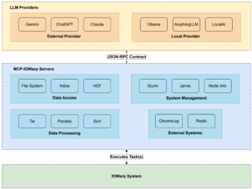
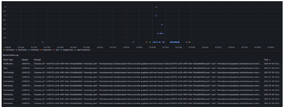
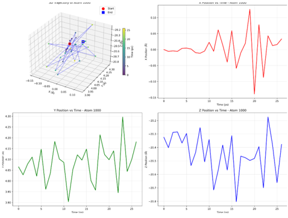

## Towards an AI-driven scientific workflow

1 st Shazzadul Islam, 2 nd Jaime Cernuda, 3 rd Isa Muradli, 4 th Anthony Kougkas, 5 th Xian-He Sun Illinois Institute of Technology, Chicago, IL, USA { sislam6, jcernudagarcia, imuradli } @hawk.illinoistech.edu, { akougkas, sun } @illinoistech.edu

## Index Terms

AI, LLMs, MCP, HPC, AI-driven Science.

## I. EXTENDED ABSTRACT

Modern scientific computing requires researchers to navigate a complex ecosystem of disconnected tools and technologies. A typical computational workflow follows sequential stages-data gathering, resource allocation, application deployment, and data analysis-each requiring distinct tools and manual management, diverting scientists from hypothesis-driven discovery to computational housekeeping. Rapidly evolving and diverse computing architectures intensify the problem, demanding specialized tools to meet High Performance Computing (HPC) needs for massive data volumes and extreme performance requirements. This requires researchers to adapt their workflows to new hardware and programming models, leading to productivity barriers as they must master dozens of tools before beginning scientific investigations.

Large language models (LLMs) simplify HPC tasks through natural language interfaces. Instead of writing an sbatch script with --nodes , --ntasks-per-node , and --time flags for a molecular dynamics simulation, a scientist can prompt: 'Run my simulation on 32 cores for three hours'. Researchers have already used ChatGPT Code Interpreter to load and analyze large HDF5 outputs and generate plots [[1]](#ref-1), while GitHub Copilot assists in writing Slurm job scripts, ADIOS/HDF5 parsing routines, and optimized numerical kernels, speeding HPC workflow development [[2]](#ref-2). However, these methods depend on LLMs having detailed knowledge of the target system, causing reliability and portability issues.

Recent advancements have introduced agentic systems, where a software orchestrator enables continuous prompting and multiple inferences per query, making AI-enabled science more robust. Within this framework, LLMs call tools-predetermined code executed by an orchestrator with results enriched back into the model's context. The Model Context Protocol (MCP) [[3]](#ref-3), introduced by Anthropic, provides a standardized framework to define and communicate with these tools across different models and is widely adopted to build AI tools for complex ecosystems.

Although cloud and general-purpose computing ecosystems now offer dozens of MCPs, scientific computing remains underrepresented. To date, only a few scientific MCPs have been released, targeting the visualization system ParaView [[4]](#ref-4), and offering scientific data gathering tools [[5]](#ref-5), leaving a significant portion of the scientific workflow without any support.

To address this issue, we introduce IOWarp-AI , a suite of tools purposefully designed to enable AI-driven scientific workflows. IOWarp-AI supports all stages of the scientific workflows from resource allocation and data analysis to application deployment. As part of IOWarp-AI, our contributions are:

- IOWarp-MCP : a suite of MCPs for scientific systems, designed with data reduction techniques for a large volume of HPC data.
- IOWarp-Observer : A design for an end-to-end observability layer that captures the entire chain of thought of the LLM and the interactions with the tools and real system .

Fig. 1. IOWarp-MCP architecture.

<!-- image -->

## II. IOWARP-MCP: ACCESS TO SCIENTIFIC RESOURCES

IOWarp-MCPs delivers a suite of pre-built MCP servers spanning the full HPC workflow spectrum (Figure 1), employing two core design principles to manage large-scale scientific datasets. First, chunked I/O access mitigates memory constraints by partitioning variables along their primary dimension into dynamically-sized segments according to the model capabilities, tracking metadata to enable lazy evaluation, and preventing memory exhaustion. Second, label-based filtering applies selective data reduction at the tool-output interface before AI model ingestion, significantly reducing context overhead while preserving the needed semantics.

## III. IOWARP-OBSERVER: REPRODUCIBLE AI SCIENCE

Reproducibility is one of the core pillars of the scientific method. AI agents, by their very nature, present a tunable degree of non-deterministic behavior. While it is this nondeterminism that allows them to react to never-before-seen, unpredictable situations, it also tests the ability to reproduce AI-enabled workloads. To address this issue, we have

Fig. 2. Visualization of the IOWarp-Observer log collection.

<!-- image -->

developed IOWarp-Observer , an end-to-end observability pipeline that can connect to any AI agent and collect all interactions, such as queries and responses between the user and the agent, and between the agent and any tool. All data is stored in a time series database and can be connected to a web-based dashboard for visualization, as seen in Figure 2.

## IV. USE CASE

We conducted tests to evaluate the correctness, performance, and reliability of our MCP design. Video recordings are available on GitHub 1 along with the MCP implementation code 2 .

In this section, we present the results of a data analysis of the BP5 dataset using LAMMPS to simulate the melting of a face-centered cubic gold crystal. The simulation gradually heats the gold cube from an initial temperature of 1 K to a final temperature of 2500 K throughout 100 picoseconds. We enabled an agent with Adios-MCP and provided the following prompt: ' Explore the dataset. Plot the trajectory of a single atom over time. The atom of choice should be a parameter in the script. The output of the script should be a PNG image with the results. Run the script for any single atom. ' The execution completed in 2.5 minutes (manually took 12 minutes) using Claude Sonnet 3.5. The results are shown in Figure 3.

Fig. 3. Simulated trajectories

<!-- image -->

## 1. https://github.com/JaimeCernuda/demo/tree/master

## 2. https://github.com/iowarp/iowarp-mcps

Fig. 4. IOR deployment evaluation

<!-- image -->

We evaluated automated IOR benchmark deployment via Jarvis-MCP across 4 agent+model combinations with 20 variations of a single prompt. Figure 4 reveals different performance profiles: Gemini CLI + Gemini 2.5 Pro emerges as optimal (14 operations, 100%), Cursor + Gemini 2.5 Pro provides fastest deployment (42 s, 100%), Claude Code + Claude Sonnet 4 offers reliable baseline performance (95%, 8.7 operations), while Cursor + GPT-5 demonstrates complete configuration failure (0% nprocs=8) defaulting to nprocs=1 because of failing to identify parallel-processing API endpoints. However, when the configuration prompt was revised to explicitly specify parallel execution parameters, the success rates improved to 100%, matching other agents. Compared to manual HPC pipeline configuration (5-10 minutes), agents deployed IOR in 42-61 s, validating IOWarp-AI's multi-platform approach for selecting agents by speed, comprehensiveness, or reliability.

## V. CONCLUSION

IOWarp-AI streamlines HPC workflows with domainspecific MCPs, delivering faster and reproducible deployments. Our results demonstrate significant reductions in execution time and configuration complexity, allowing more focus on scientific discovery for researchers.

## ACKNOWLEDGMENT

This material is based upon work supported in part by the National Science Foundation (NSF), Office of Advanced Cyberinfrastructure (OAC) under Grants 2411318 and 2313154.

## REFERENCES

- [1] OpenAI, 'ChatGPT plugins,' https://openai.com/index/chatgpt-plugins/, March 2023, accessed: August 1, 2025.

- [2] M. Chen, J. Tworek, H. Jun, Q. Yuan, H. P. D. O. Pinto, J. Kaplan, H. Edwards, Y. Burda, N. Joseph, G. Brockman et al. , 'Evaluating large language models trained on code,' arXiv preprint arXiv:2107.03374 , 2021.

- [3] Anthropic, 'Model Context Protocol specification,' GitHub, 2024, accessed: August 1, 2025. [Online]. Available: https://github.com/ anthropics/mcp

- [4] S. Liu, H. Miao, and P.-T. Bremer, 'Paraview-mcp: An autonomous visualization agent with direct tool use,' 2025. [Online]. Available: https://arxiv.org/abs/2505.07064

- [5] Path Integral Institute, 'MCP.Science,' https://github.com/ pathintegral-institute/mcp.science, 2025, version 0.1.0, released 202505-21.